# Exercise 1: Discover and assess the on-premises environment

Duration: 60 minutes

## Overview

In this exercise, you will use Azure Migrate: Server Assessment to assess the on-premises environment. This will include selecting Azure Migrate tools, deploying the Azure Migrate appliance into the on-premises environment, creating a migration assessment, and using the Azure Migrate dependency visualization.

### Task 1: Create the Azure Migrate project and add assessment and migration tools

In this task, you will create the Azure Migrate project and select the assessment and migration tools.

> **Note**: In this lab, you will use the Microsoft-provided assessment and migration tools within Azure Migrate. A number of third-party tools are also integrated with Azure Migrate for both assessment and migration. You may wish to spend some time exploring these third-party options outside of this lab.

1. Open your browser, navigate to **<https://portal.azure.com>**, and log in with your Azure subscription credentials.

2. Expand the left navigation, and select **All services**. Search for and select **Azure Migrate** to open the Azure Migrate Overview blade, shown below.

    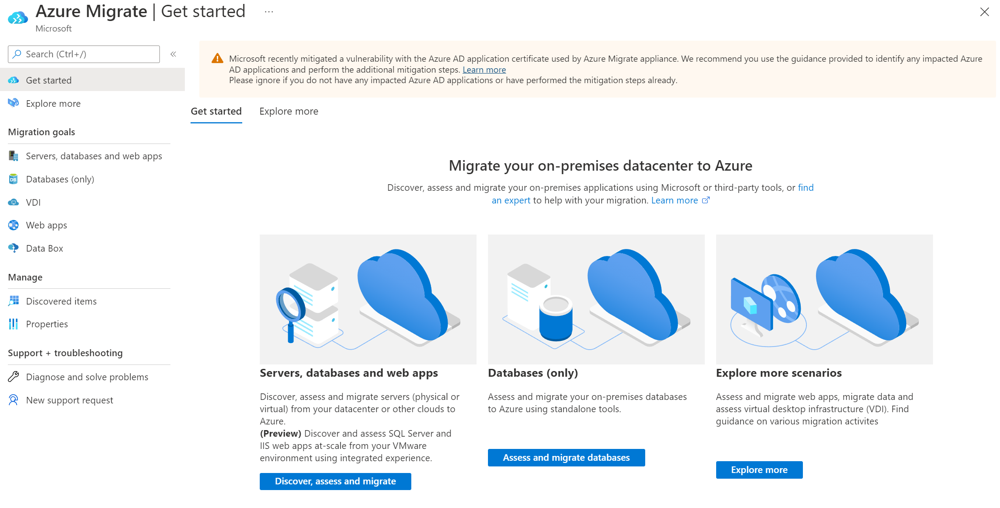

3. From the **Get started** tab, select the **Discover, assess and migrate** button located beneath the **Servers, databases and web apps** heading.

    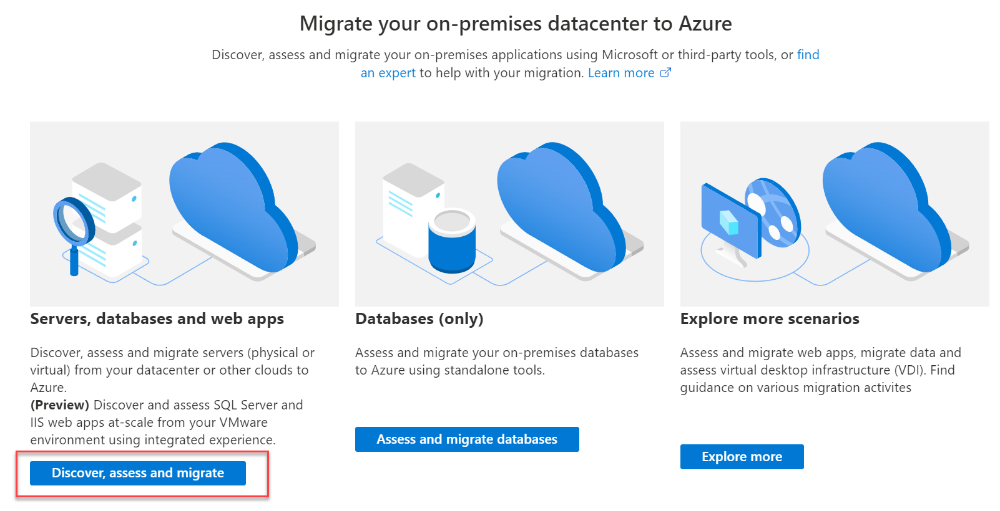  

4. On the **Servers, databases and web apps** screen, select **Create project**.

    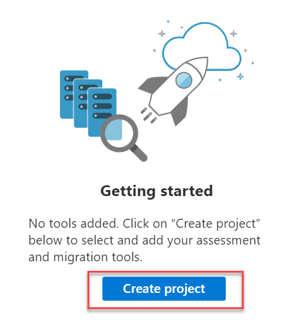

5. On the **Create project** screen, select your subscription and create a new resource group named **AzureMigrateRG**. Enter **SmartHotelMigration** as the Project name, and choose a Geography close to you to store the migration assessment data. Then select **Create**.

    >**Note**: If you are running this lab in a shared subscription you will need to use a migrate project name that is unique in the subscription. Append characters to the end of migrate project name to make your project name unique. For example: **SmartHotelMigration1234**.

    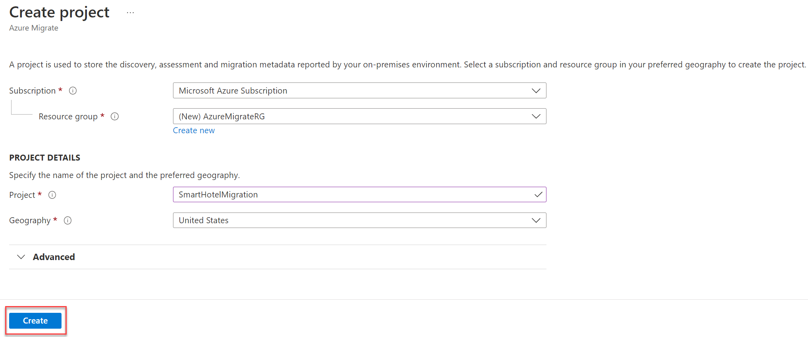

6. The Azure Migrate project deployment will start. Once it has completed, you should see the **Azure Migrate: Discovery and assessment** and **Azure Migrate: Server Migration** panels for the current migration project, as shown below.

    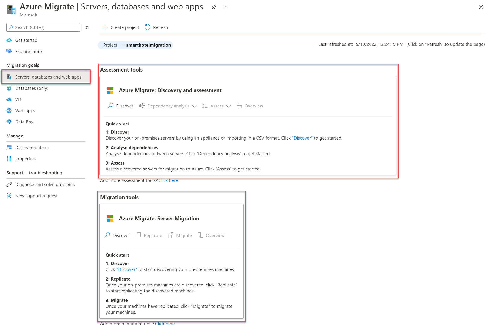

#### Task summary

In this task you created an Azure Migrate project, using the default built-in tools for server assessment and server migration.

### Task 2: Deploy the Azure Migrate appliance

In this task, you will deploy and configure the Azure Migrate appliance in the on-premises Hyper-V environment. This appliance communicates with the Hyper-V server to gather configuration and performance data about your on-premises VMs, and returns that data to your Azure Migrate project.

1. Within the **Azure Migrate: Discovery and assessment** panel, select the **Discover** toolbar item. **Discover machines** blade.

    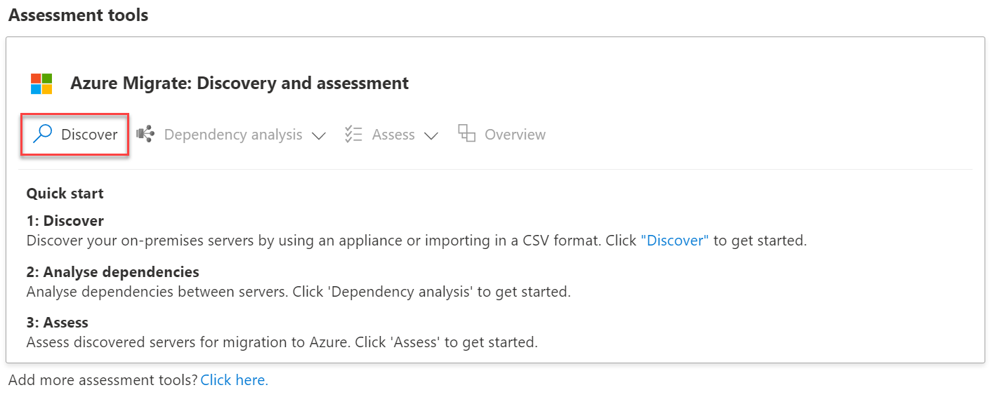  

2. On the **Discover** form, for the **Are your machines virtualized?** field, select **Yes, with Hyper-V**. Once selected, a form will appear.

    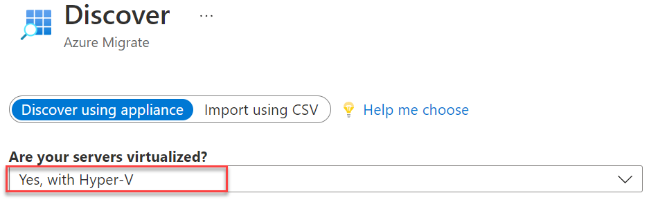

3. In **1: Generate Azure Migrate project key**, provide **SmartHotelAppl** as name for the Azure Migrate appliance that you will set up for discovery of Hyper-V VMs. Select **Generate key** to start the creation of the required Azure resources.

    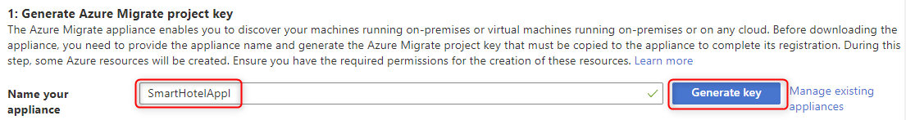

    >**Note**: If you are running this lab in a shared Azure Migrate project, you will need to provide an appliance name that is unique in the project. Append characters to the end of appliance name to make your appliance name unique. For example: **SmartHotelAppl123**.

4. **Wait** for the key to be generated, then copy the **Azure Migrate project key** to your clipboard.

    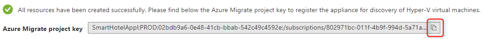

5. Read the instructions on how to download, deploy and configure the Azure Migrate appliance. Close the 'Discover machines' blade (do **not** download the .VHD file or .ZIP file, the .VHD has already been downloaded for you).

6. In a separate browser tab, navigate to the Azure portal. In the global search box, enter **SmartHotelHost**, then select the **SmartHotelHost** virtual machine.

    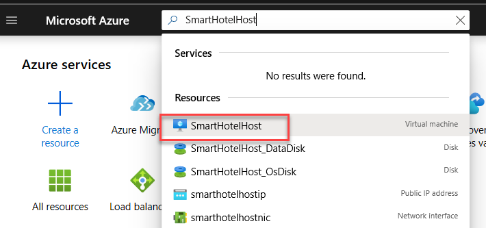

7. Select **Connect**, select **RDP**, then download the RDP file and connect to the virtual machine using username **demouser** and password **demo!pass123**.

8. In Server Manager, select **Tools**, then **Hyper-V Manager** (if Server Manager does not open automatically, open it by selecting **Start**, then **Server Manager**). In Hyper-V Manager, select **SMARTHOTELHOST**. You should now see a list of the four VMs that comprise the on-premises SmartHotel application.

    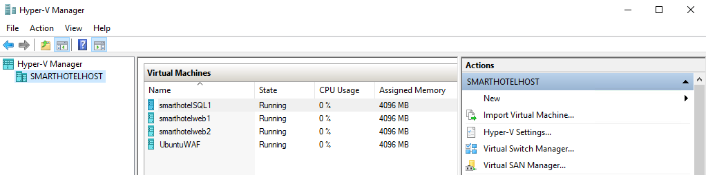

    You will now deploy the Azure Migrate appliance virtual machine.  Normally, you would first need to download the .ZIP file containing the appliance to your Hyper-V host, and unzip it. To save time, these steps have been completed for you.

9. In Hyper-V Manager, under **Actions**, select **Import Virtual Machine...** to open the **Import Virtual Machine** wizard.

    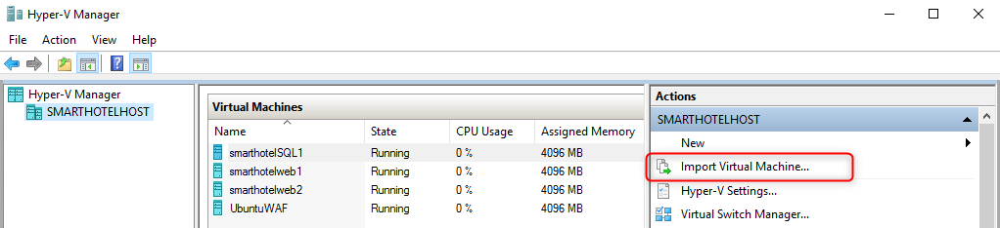

10. At the first step, **Before You Begin**, select **Next**.

11. At the **Locate Folder** step, select **Browse** and navigate to **F:\\VirtualMachines\\AzureMigrateAppliance**, then choose **Select Folder**, then select **Next**.

    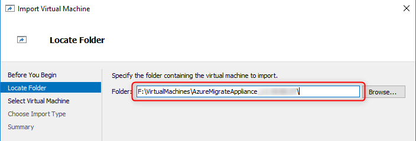

12. At the **Select Virtual Machine** step, the **AzureMigrateAppliance** VM should already be selected. Select **Next**.

13. At the **Choose Import Type** step, keep the default setting **Register the virtual machine in-place**. Select **Next**.

14. At the **Connect Network** step, you will see an error that the virtual switch previously used by the Azure Migrate appliance could not be found. From the **Connection** drop down, select the **Azure Migrate Switch**, then select **Next**.

    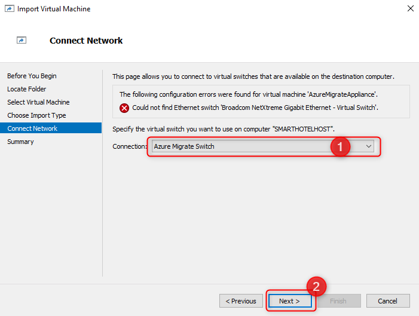

    > **Note**:  The Azure Migrate appliance needs access to the Internet to upload data to Azure. It also needs access to the Hyper-V host. However, it does not need direct access to the application VMs running on the Hyper-V host. To protect the application environment, the Azure Migrate Appliance should be deployed to a separate subnet within Hyper-V, rather than in the same subnet as your application. 
    >
    > The Hyper-V environment has a NAT network using the IP address space 192.168.0.0/16. The internal NAT switch used by the SmartHotel application uses the subnet 192.168.0.0/24, and each VM in the application has been assigned a static IP address from this subnet.
    >
    > The Azure Migrate Appliance will be connected to a separate subnet 192.168.1.0/24, which has been set up for you. Using the 'Azure Migrate Switch' connects the appliance to this subnet. The appliance is assigned an IP address from this subnet using a DHCP service running on the SmartHotelHost.

15. Review the summary page, then select **Finish** to create the Azure Migrate appliance VM.

16. In Hyper-V Manager, select the **AzureMigrateAppliance** VM, then select **Start** on the left.

   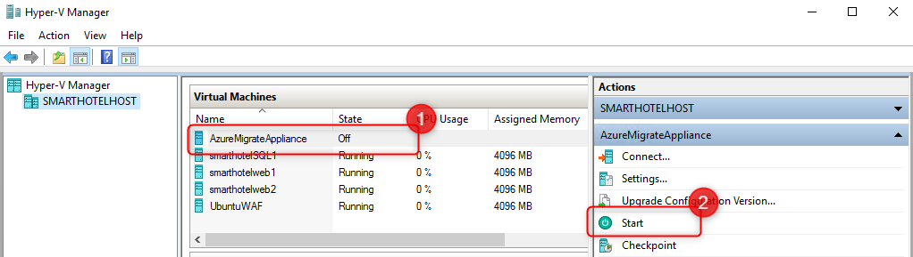

#### Task summary

In this task you deployed the Azure Migrate appliance in the on-premises Hyper-V environment.

### Task 3: Configure the Azure Migrate appliance

In this task, you will configure the Azure Migrate appliance and use it to complete the discovery phase of the migration assessment.

1. In Hyper-V Manager, select the **AzureMigrateAppliance** VM, then select **Connect** on the left.

    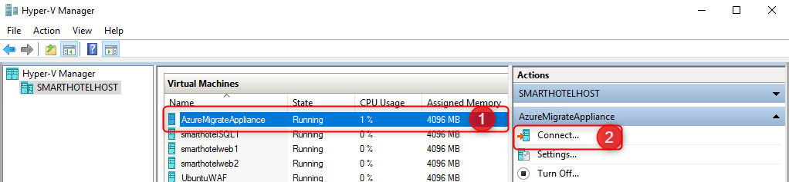

2. A new window will open showing the Azure Migrate appliance. Wait for the License terms screen to show, then select **Accept**.

    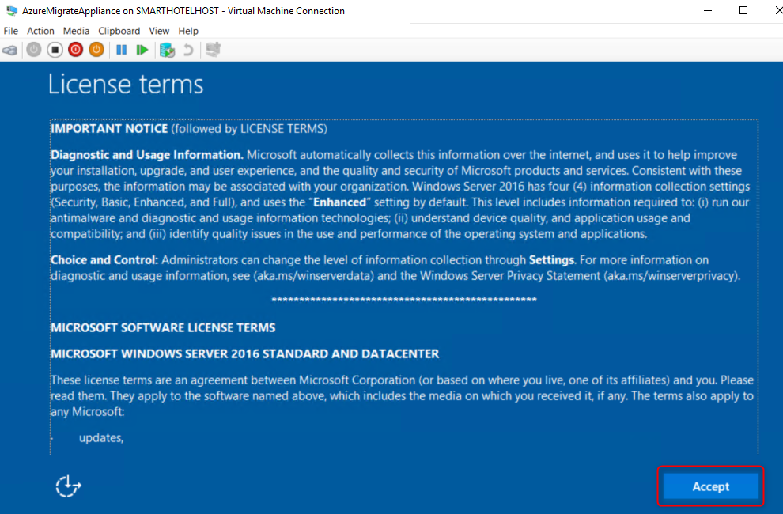

3. On the **Customize settings** screen, set the Administrator password to **demo!pass123** (twice). Then select **Finish**.

    > **Note**: When entering the password, the VM uses a US keyboard mapping. If you are using a non-US keyboard, some characters may be entered incorrectly. Select the 'eyeball' icon in the second password entry box to check the password has been entered correctly.

    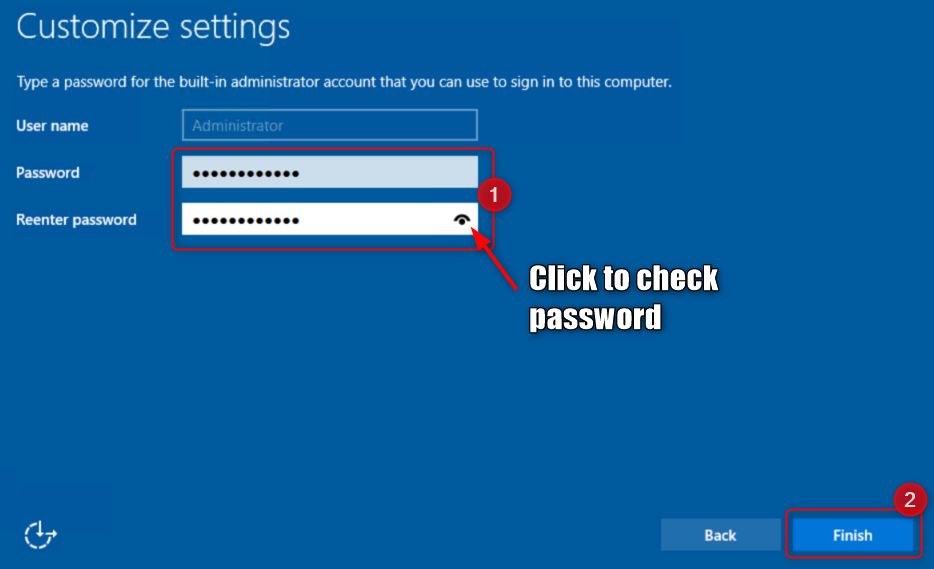

4. At the **Connect to AzureMigrateAppliance** prompt, set the appliance screen size using the slider, then select **Connect**.

5. Log in with the Administrator password **demo!pass123** (the login screen may pick up your local keyboard mapping, use the 'eyeball' icon to check).

6. **Wait.** After a minute or two, the browser will open showing the Azure Migrate appliance configuration wizard (it can also be launched from the desktop shortcut).

    On opening of the appliance configuration wizard, a pop-up with the license terms will appear. Accept the terms by selecting **I agree**.

    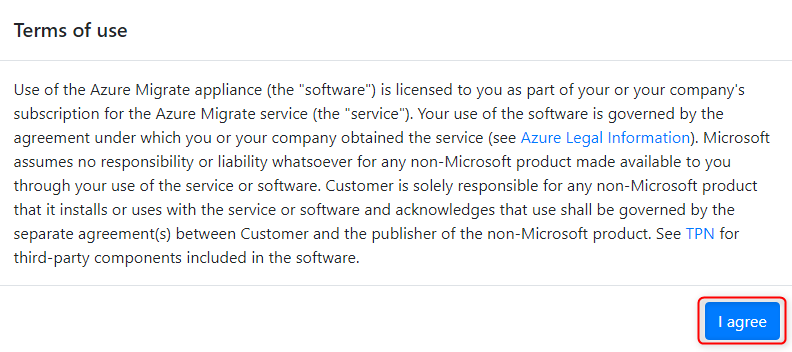

7. Under **Set up prerequisites**, the following two steps to verify Internet connectivity and time synchronization should pass automatically.

    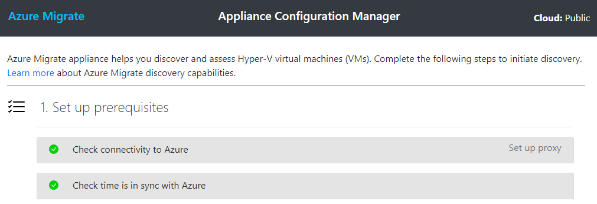

8. In the **Check latest updates and register appliance** section, under the **Verification of Azure Migrate project key** heading, paste the **Azure Migrate project key** copied from the Azure portal earlier. (If you do not have the key, go to **Server Assessment > Discover > Manage existing appliances**, select the appliance name you provided at the time of key generation and copy the corresponding key.). Select **Verify**.

    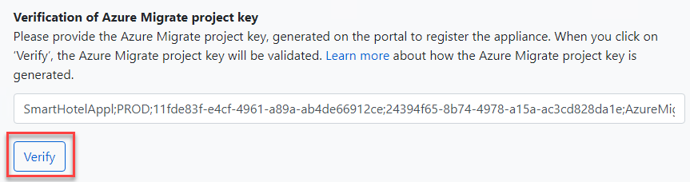

9. **Wait** while the wizard installs the latest Azure Migrate updates. If prompted for credentials, enter user name **Administrator** and password **demo!pass123**. Once the Azure Migrate updates are completed, you may see a pop-up if the management app restart is required, and if so, select **Refresh** to restart the app.  

    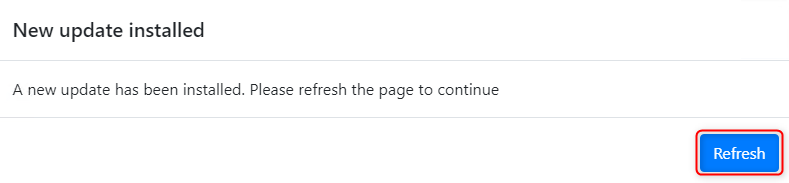

10. Re-run the prerequisites if neccessary. Once complete, select **Login** beneath the **Azure user login and appliance registration status** header.

    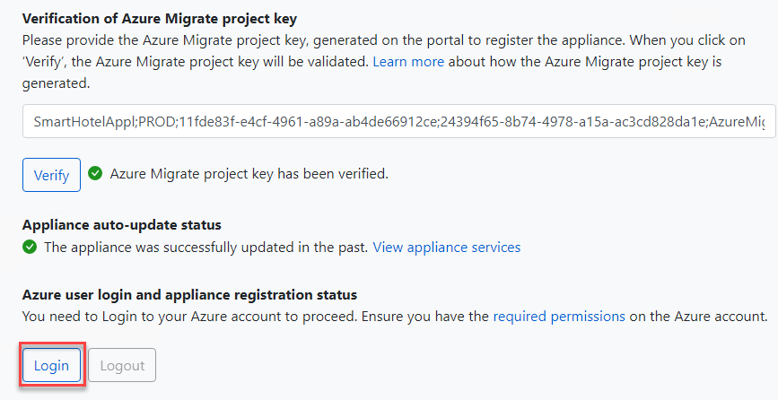

11. The **Continue with Azure Login** dialog window displays, select the **Copy code &amp; login** button.

    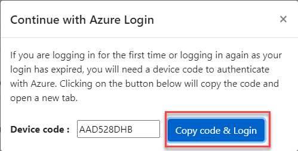

12. A new tab will open asking for a code. This code is already in the clipboard. Paste the code in the form.  You will then be asked for your Azure portal credentials to complete the login process.

    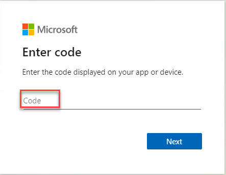

13. **Wait** a few moments for the registration process to complete. A message will be displayed indicating the appliance is successfully registered.

    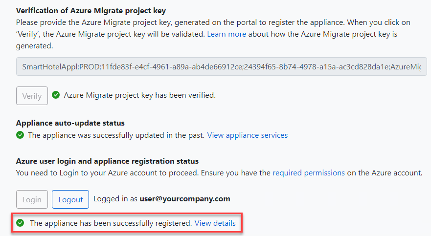

    Once the registration has completed, you can proceed to the next panel, **2. Manage credentials and discovery sources**.

14. In **Step 1: Provide Hyper-V host credentials for discovery of Hyper-V VMs​**, select **Add credentials**.

    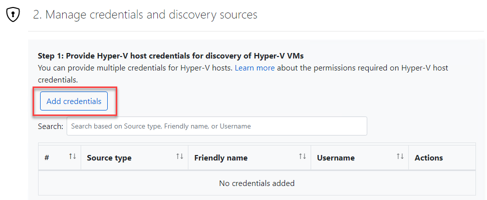

15. Specify **hostlogin** as the friendly name for credentials, username **demouser**, and password **demo!pass123** for the Hyper-V host/cluster that the appliance will use to discover VMs. Select **Save**.

    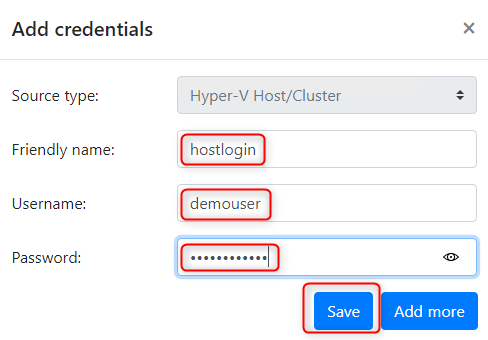

     > **Note**: The Azure Migrate appliance may not have picked up your local keyboard mapping. Select the 'eyeball' in the password box to check the password was entered correctly.

     > **Note:** Multiple credentials are supported for Hyper-V VMs discovery, via the 'Add more' button.

16. In **Step 2: Provide Hyper-V host/cluster details**, select **Add discovery source** to specify the Hyper-V host/cluster IP address/FQDN and the friendly name for credentials to connect to the host/cluster.

    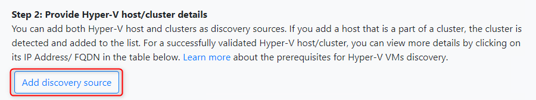

17. In the **Add discovery source** dialog, select **Add single item**, enter **SmartHotelHost** under 'IP Address / FQDN', and select **hostlogin** for **Map credentials**.

    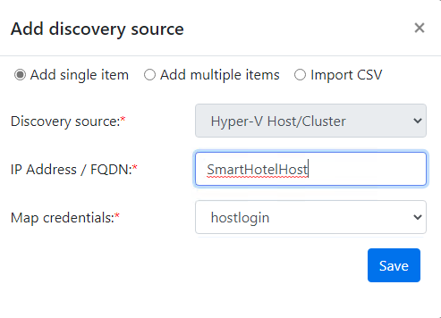

    > **Note:** You can either **Add single item** at a time or **Add multiple items** in one go. There is also an option to provide Hyper-V host/cluster details through **Import CSV**.

18. Select **Save**. The appliance will validate the connection to the Hyper-V hosts/clusters added and show the **Validation status** in the table against each host/cluster.

    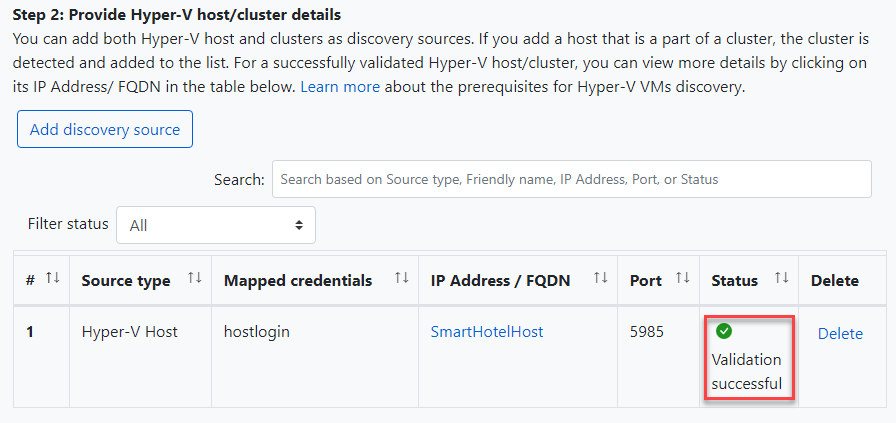

    > **Note:** When adding discovery sources:
    >
    > - For successfully validated hosts/clusters, you can view more details by selecting their IP address/FQDN.
    > - If validation fails for a host, review the error by selecting the Validation failed in the Status column of the table. Fix the issue and validate again.
    > - To remove hosts or clusters, select **Delete**.
    > - You can't remove a specific host from a cluster. You can only remove the entire cluster.
    > - You can add a cluster, even if there are issues with specific hosts in the cluster.

19. In **Step 3: Provide server credentials to perform software inventory and agentless dependency analysis.**, disable the slider to the off position.

    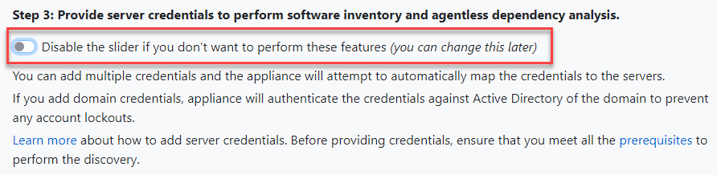

20. Select **Start discovery** to kick off VM discovery from the successfully validated hosts/clusters.

    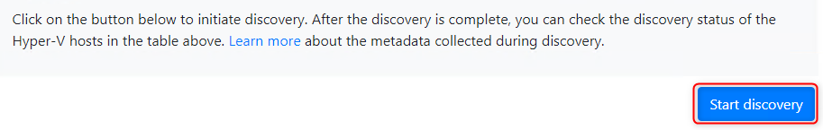

21. Wait for the Azure Migrate status to show **Discovery has been successfully initiated**. This will take several minutes. After the discovery has been successfully initiated, you can check the discovery status against each host/cluster in the table.

22. Return to **Azure Migrate** and select **Servers, databases and web apps** from the left menu. Under **Azure Migrate: Discovery and assessment** you should see a count of the number of servers discovered so far. If discovery is still in progress, select **Refresh** periodically until 5 discovered servers are shown. This may take several minutes.

    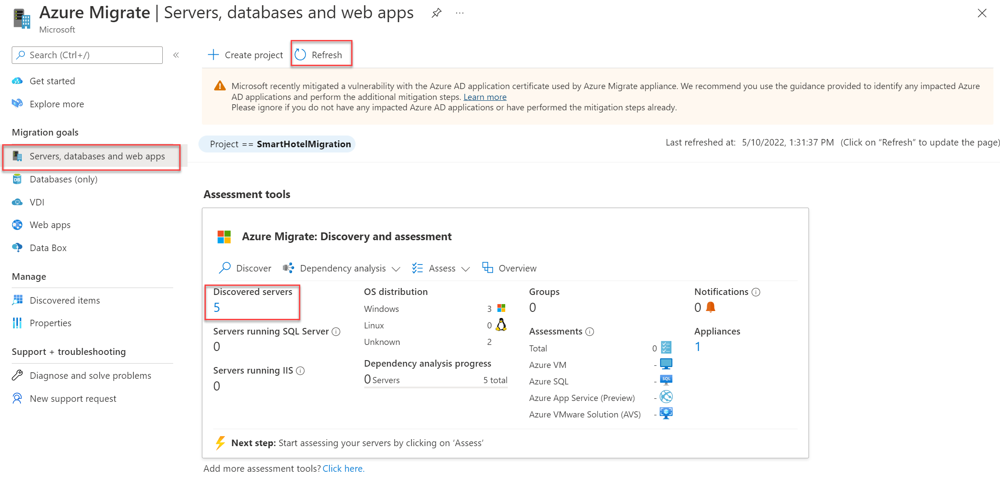

    **Wait for the discovery process to complete before proceeding to the next Task**.

>**Note**: If the discovery process takes an inordinate amount of time or the source resources are not allowing the appliance to discover the resources in an appropriate time to complete this exercise, you can manually import the systems via CSV:
>
>_Discover Import_
>
>If the system is not able to assess the environment or identify details, you can import an inventory of the environment, their configuration, and utilization with a CSV file.  You can download an example [CSV file here](https://go.microsoft.com/fwlink/?linkid=2109031). The properties in the CSV are:
>
> - Server Name – name of the computer
> - IP Addresses – semi-colon separated list of IPv4 and IPv6 addresses used by the machine
> - Cores – number of vCPU used
> - Memory – amount of memory in MB
> - OS Details
>   - Name – type of operating system
>   - Version – version of the OS in use
>   - Architecture – architecture (like x64/x86)
> - CPU Utilization – percentage of the CPU in use
> - Memory Utilization – percentage spike of the CPU usage
> - Network
>   - Adapter count – number of NIC’s attached to the machine
>   - Input Throughput – amount of throughput in Mbps into system
>   - Output Throughput – amount of throughput in Mbps out of the system
> - Boot Type – type of boot used by systems (UEFI/BIOS)
> - Disks
>   - Number of disks – number of disks attached to disk
>   - Per disk size – size of disk in GB
>   - Per disk reads (Bytes) – amount of MB per second read from each disk
>   - Per disk writes (Bytes) – amount of MB per second written to each disk
>   - Per disk reads (IOPS) – count of output operations from disk per second
>   - Per disk writes (IOPS) – count of input operations from disk per second
>
> Once the CSV is populated, you can then import the systems into the Migrate assessment phase by doing the following:
>
> 1. Go to Azure Migrate, under Migration goals, select the appropriate resource type (i.e., Windows, Linux and SQL Server).
> 2. Select the **Discover** link.
>
>    
>
> 3. Choose **Import using CSV** at the top.
>
>    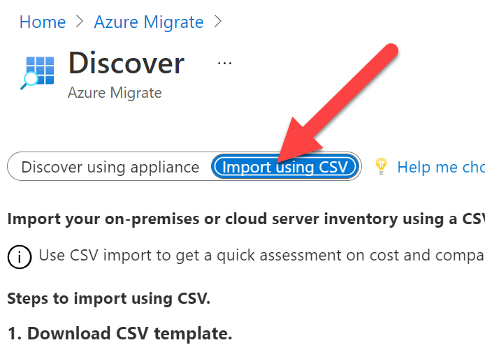
>
> 4. Upload the CSV file of your resources using the on-screen instructions by selecting **Import** to read the file.

#### Task summary

In this task you configured the Azure Migrate appliance in the on-premises Hyper-V environment and started the migration assessment discovery process.

### Task 4: Create a migration assessment

In this task, you will use Azure Migrate to create a migration assessment for the SmartHotel application, using the data gathered during the discovery phase.

1. Continuing from Task 3, under **Azure Migrate: Discovery and assessment** select **Assess** and, in the drop-down menu, select **Azure VM** to start a new migration assessment.

    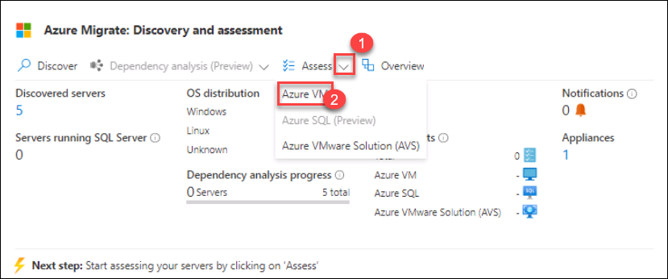

2. On the **Create Assessment Basics** blade, ensure the **Assessment type** is set to **Azure VM** and **Discovery Source** is set to **Servers discovered from Azure Migrate Appliance**. Under **Assessment properties**, select **Edit**.

    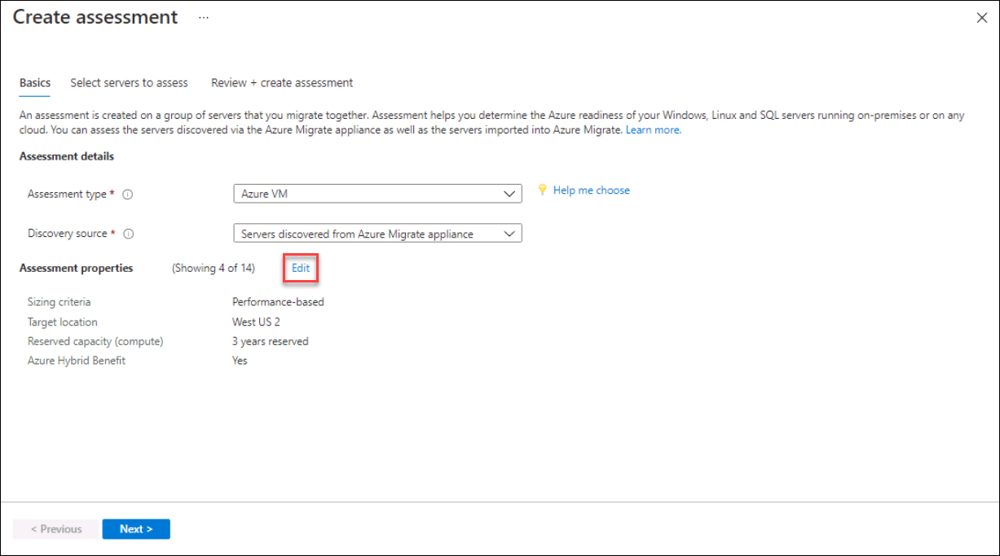

3. The **Assessment properties** blade allows you to tailor many of the settings used when making a migration assessment report. Take a few moments to explore the wide range of assessment properties. Hover over the information icons to see more details on each setting. Choose any settings you like, then select **Save**. (You have to make a change for the Save button to be enabled; if you don't want to make any changes, just close the blade.)

    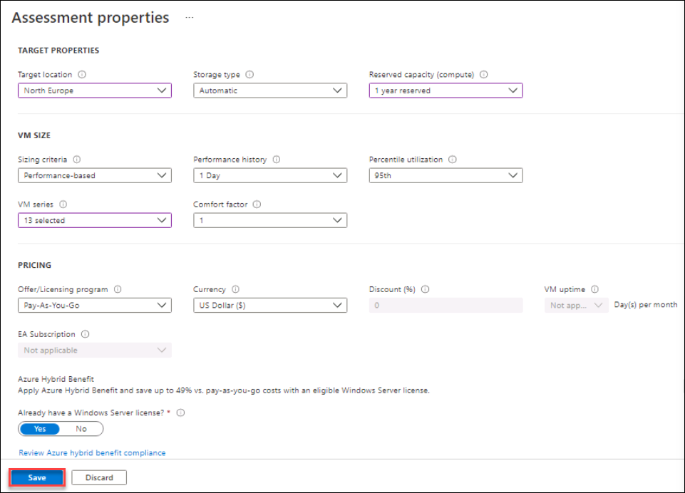

4. Select **Next** to move to the **Select servers to assess** tab. Choose **Create New**, enter the assessment name **SmartHotelAssessment** and the group name **SmartHotel VMs**. Select the **smarthotelweb1**, **smarthotelweb2** and **UbuntuWAF** VMs.

    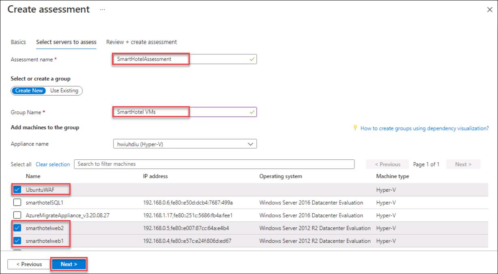

    **Note:** There is no need to include the **smarthotelSQL1** or **AzureMigrateAppliance** VMs in the assessment, since they will not be migrated to Azure. (The SQL Server will be migrated to the SQL Database service and the Azure Migrate Appliance is only used for migration assessment.)

5. Select **Next: Review +create assessment**, followed by **Create assessment**. On the **Azure Migrate: Servers, databases and web apps** blade, select **Refresh** periodically until the number of assessments shown is **1**. This may take several minutes. Select the count Total link beneath assessments to continue.

    ")

6. The **Azure Migrate: Discovery and assessment | Assessments** screen displays. Select the assessment from the list.

    ")

7. Take a moment to study the assessment overview.

    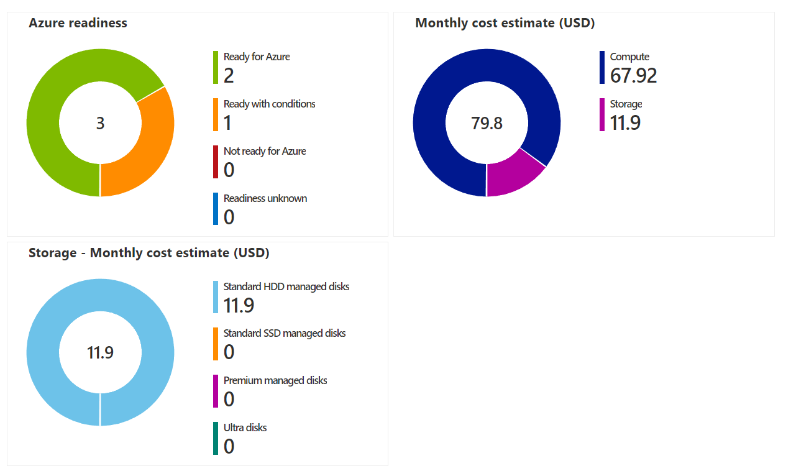

8. Select **Edit properties**. Note how you can now modify the assessment properties you chose earlier. Change a selection of settings, and **Save** your changes. After a few moments, the assessment report will update to reflect your changes.

9. Select **Azure readiness** (either the chart or on the left navigation). Note that for the **UbuntuWAF** VM, a specific concern is listed regarding the readiness of the VM for migration.

    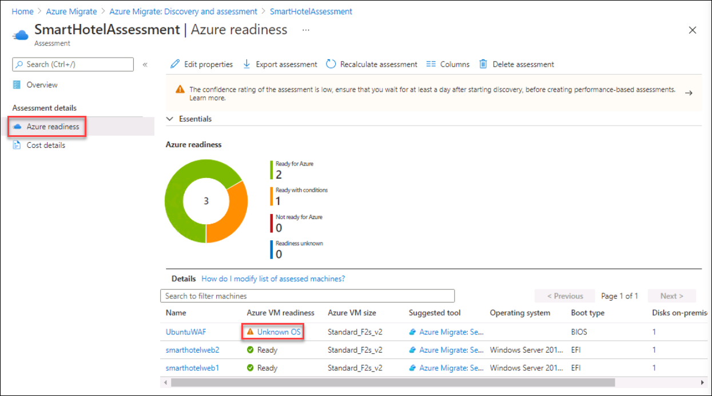

10. Select **Unknown OS** for **UbuntuWAF**. A new browser tab opens showing Azure Migrate documentation. Note on the page that the issue relates to the OS not being specified in the host hypervisor, so you must confirm the OS type and version is supported.

    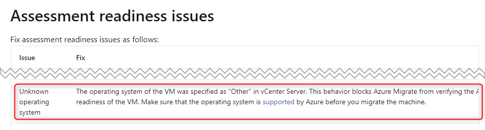

11. Return to the portal browser tab. Select the link for **UbuntuWAF** to see details of the issue. Note the recommendation to migrate the VM using **Azure Migrate: Server Migration**.

    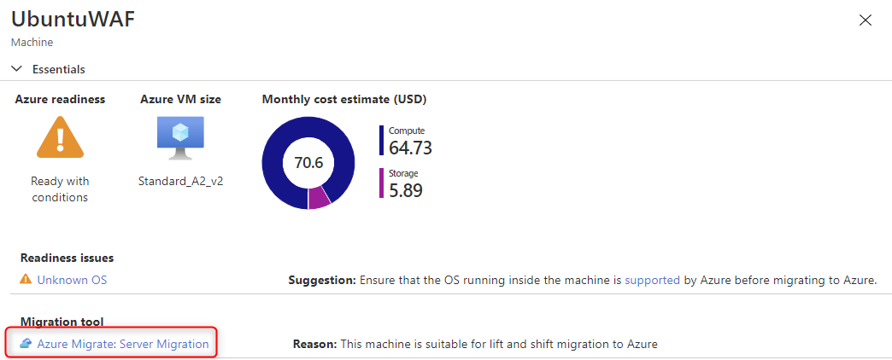

12. Take a few minutes to explore other aspects of the migration assessment.

>**Note**: The process of gathering information of operating system environments (OSE) and migrating data of VMs between environments takes some time due to the nature of transferring data.  However, there are a few steps that can be done to speed up and view how the system works.  These are a few options:
>
> Common steps to refresh data: (also see [Troubleshoot Discovery](https://docs.microsoft.com/azure/migrate/troubleshoot-discovery#common-software-inventory-errors))
>
> - [Server data not updating in portal](https://docs.microsoft.com/azure/migrate/troubleshoot-discovery#server-data-not-updating-in-portal) – if the servers’ data is not refreshing, this is a method to accelerate it.
> - [Do not see software inventory details](https://docs.microsoft.com/azure/migrate/troubleshoot-discovery#do-not-see-software-inventory-details-even-after-updating-guest-credentials) – by default the software inventory is only refreshed once every 24 hours. This forces a refresh.
> - [Software inventory errors](https://docs.microsoft.com/azure/migrate/troubleshoot-discovery#common-software-inventory-errors) – during inventory there are sometimes error codes returned. This lists all the error codes and meanings.
>
> _Refresh Data_
>
> Many issues in the Migrate can be related to the appliance not refreshing the data due to regular schedules or data not being transferred.  Forcing the data and information to be updated can be achieved with the following steps:
>
> 1. In Windows, Linux and SQL Servers > Azure Migrate: Discovery and assessment, select Overview.
> 2. Under Manage, select Appliances.
> 3. Select Refresh services.
> 4. Wait for the refresh operation to complete. You should now see up-to-date information.

#### Task summary

In this task you created and configured an Azure Migrate migration assessment.

### Task 5: Configure dependency visualization

When migrating a workload to Azure, it is important to understand all workload dependencies. A broken dependency could mean that the application doesn't run properly in Azure, perhaps in hard-to-detect ways. Some dependencies, such as those between application tiers, are obvious. Other dependencies, such as DNS lookups, Kerberos ticket validation or certificate revocation checks, are not.

In this task, you will configure the Azure Migrate dependency visualization feature. This requires you to first create a Log Analytics workspace, and then to deploy agents on the to-be-migrated VMs.

1. Return to the **Azure Migrate** blade in the Azure Portal, and select **Servers databases and web apps**. Under **Azure Migrate: Discovery and assessment** select **Groups**, then select the **SmartHotel VMs** group to see the group details. Note that each VM has their **Dependencies** status as **Requires agent installation**. Select **Requires agent installation** for the **smarthotelweb1** VM.

    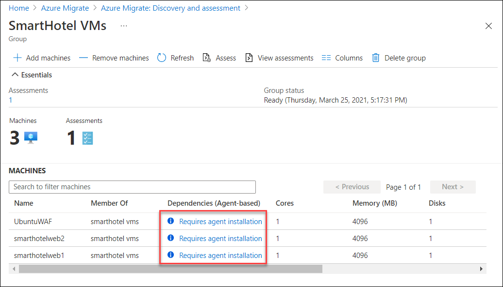

2. On the **Dependencies** blade, select **Configure OMS workspace**.

    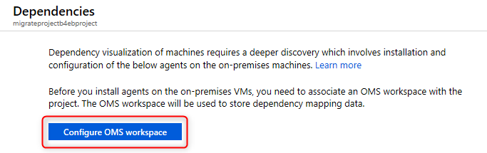

3. Create a new OMS workspace. Use **AzureMigrateWS\<unique number\>** as the workspace name, where \<unique number\> is a random number. Choose a workspace location close to your lab deployment, then select **Configure**.

    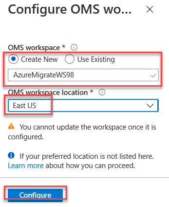

4. Wait for the Log Analytics workspace to be deployed. Once it is deployed, navigate to it, and select **Agents management** under **Settings** on the left. Make a note of the **Workspace ID** and **Primary Key** (for example by using Notepad).

    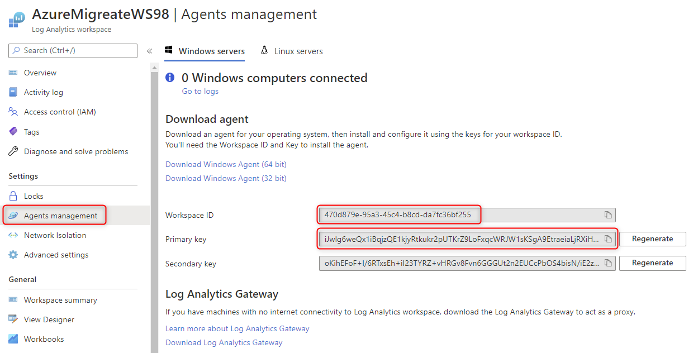

5. Return to the Azure Migrate 'Dependencies' blade. Copy each of the 4 agent download URLs and paste them alongside the Workspace ID and key you noted in the previous step.

    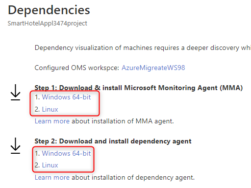

6. Return to the RDP session with the **SmartHotelHost**. In **Hyper-V Manager**, select **smarthotelweb1** and select **Connect**.

    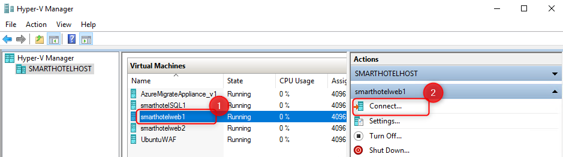

7. Select **Connect** again when prompted and log in to the **Administrator** account using the password **demo!pass123**.

8. Open **Internet Explorer**, and paste the link to the 64-bit Microsoft Monitoring Agent for Windows, which you noted earlier. When prompted, **Run** the installer.

    > **Note:** You may need to disable **Internet Explorer Enhanced Security Configuration** on **Server Manager** under **Local Server** to complete the download.

    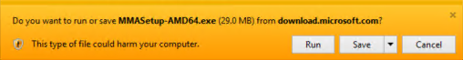

9. Select through the installation wizard until you get to the **Agent Setup Options** page. From there, select **Connect the agent to Azure Log Analytics (OMS)** and select **Next**. Enter the Workspace ID and Workspace Key that you copied earlier, and select **Azure Commercial** from the Azure Cloud drop-down. Select through the remaining pages and install the agent.

    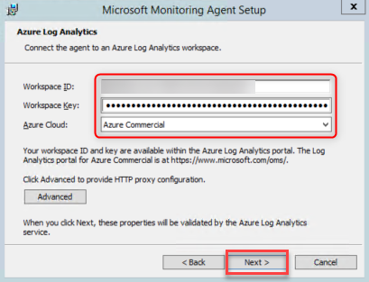

10. Paste the link to the Dependency Agent Windows installer into the browser address bar. **Run** the installer and select through the install wizard to complete the installation.

    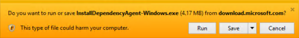

    > **Note:** You do not need to configure the workspace ID and key when installing the Dependency Agent, since it uses the same settings as the Microsoft Monitoring Agent, which must be installed beforehand.

11. Close the virtual machine connection window for the **smarthotelweb1** VM.  Connect to the **smarthotelweb2** VM and repeat the installation process (steps 8-10) for both agents (the administrator password is the same as for smarthotelweb1).

    You will now deploy the Linux versions of the Microsoft Monitoring Agent and Dependency Agent on the **UbuntuWAF** VM. To do so, you will first connect to the UbuntuWAF remotely using an SSH session.

12. Return to the RDP session with the **SmartHotelHost** and open a command prompt using the desktop shortcut.  

    > **Note**: The SmartHotelHost runs Windows Server 2019 with the Windows Subsystem for Linux enabled. This allows the command prompt to be used as an SSH client. More info of supported Linux on Azure can be found here: <https://Azure.com/Linux>.

13. Enter the following command to connect to the **UbuntuWAF** VM running in Hyper-V on the SmartHotelHost:

    ```bash
    ssh demouser@192.168.0.8
    ```

14. Enter 'yes' when prompted whether to connect. Use the password **demo!pass123**.

    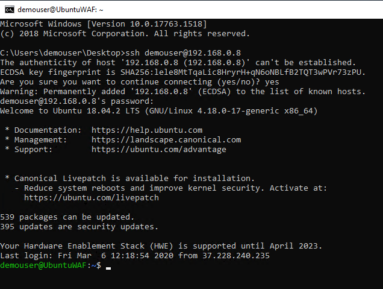

15. Enter the following command, followed by the password **demo!pass123** when prompted:

    ```s
    sudo -s
    ```

    This gives the terminal session elevated privileges.

16. Enter the following command, substituting \<Workspace ID\> and \<Workspace Key\> with the values copied previously. Answer **<Yes>** when prompted to restart services during package upgrades without asking.

    ```s
    wget https://raw.githubusercontent.com/Microsoft/OMS-Agent-for-Linux/master/installer/scripts/onboard_agent.sh && sh onboard_agent.sh -w <Workspace ID> -s <Workspace Key>
    ```

17. Enter the following command, substituting \<Workspace ID\> with the value copied earlier:

    ```s
    /opt/microsoft/omsagent/bin/service_control restart <Workspace ID>
    ```

18. Enter the following command. This downloads a script that will install the Dependency Agent.

    ```s
    wget --content-disposition https://aka.ms/dependencyagentlinux -O InstallDependencyAgent-Linux64.bin
    ```

19. Install the dependency agent by running the script download in the previous step.

    ```s
    sh InstallDependencyAgent-Linux64.bin -s
    ```

    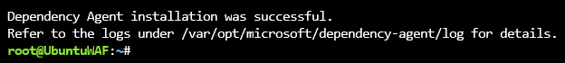

20. The agent installation is now complete. Next, you need to generate some traffic on the SmartHotel application so the dependency visualization has some data to work with. Browse to the public IP address of the SmartHotelHost, and spend a few minutes refreshing the page and checking guests in and out.

#### Task summary

In this task you configured the Azure Migrate dependency visualization feature, by creating a Log Analytics workspace and deploying the Azure Monitoring Agent and Dependency Agent on both Windows and Linux on-premises machines.

### Task 6: Explore dependency visualization

In this task, you will explore the dependency visualization feature of Azure Migrate. This feature uses data gathered by the dependency agent you installed in Task 5.

1. Return to the Azure Portal and refresh the Azure Migrate **SmartHotel VMs** VM group blade. The 3 VMs on which the dependency agent was installed should now show their status as 'Installed'. (If not, refresh the page **using the browser refresh button**, not the refresh button in the blade.  It may take up to **5 minutes** after installation for the status to be updated.)

    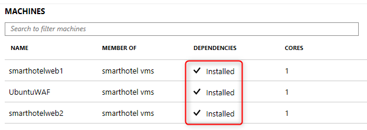

2. Select **View dependencies**.

    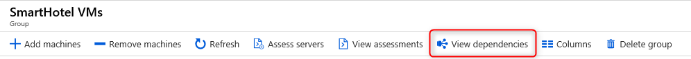

3. Take a few minutes to explore the dependencies view. Expand each server to show the processes running on that server. Select a process to see process information. See which connections each server makes.

    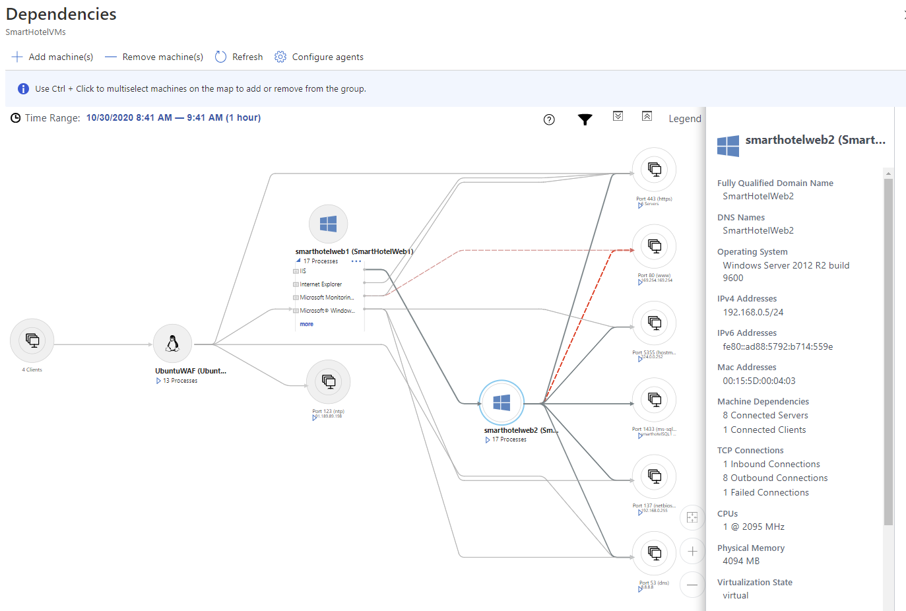

#### Task summary

In this task you explored the Azure Migrate dependency visualization feature.

#### Exercise summary

In this exercise, you used Azure Migrate to assess the on-premises environment. This included selecting Azure Migrate tools, deploying the Azure Migrate appliance into the on-premises environment, creating a migration assessment, and using the Azure Migrate dependency visualization.
