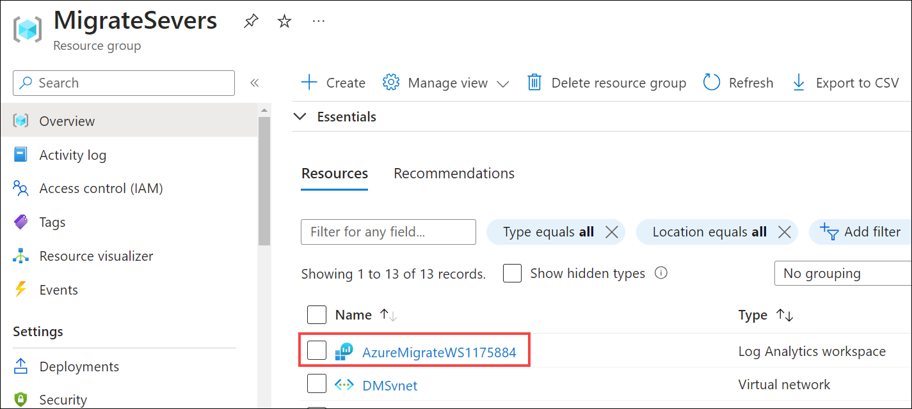

#### If attendees notice that the dependency agent status is showing as **Requires Agent Installation** instead of Installed even after installing dependency agents in all the three VMs, This is because there is an ongoing issue from Azure end where the latest status is not getting reflected in dependencies blade. Please follow the steps below to confirm dependency agent installation in VMs using **Log Analytics workspace**.
   
   1. Search for **AzureMigrateWS** Log Analytics workspace under **Azure Migrate** Resource Group and select it.

      


   1. Select **Logs (1)** under General category, enter the below query and click on **Run** **(2)** to review the connected servers information.

       ```
       Heartbeat
       ```

      


      
     
   1. Notice the **SmartHotelWeb1**, **SmartHotelWeb2** and **UbuntuWAF** servers have the required agents intsalled and are connected to the workspace.
       
      
