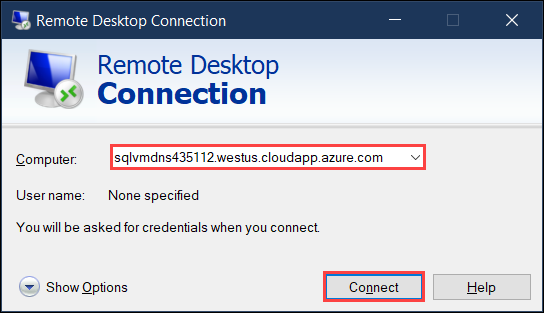
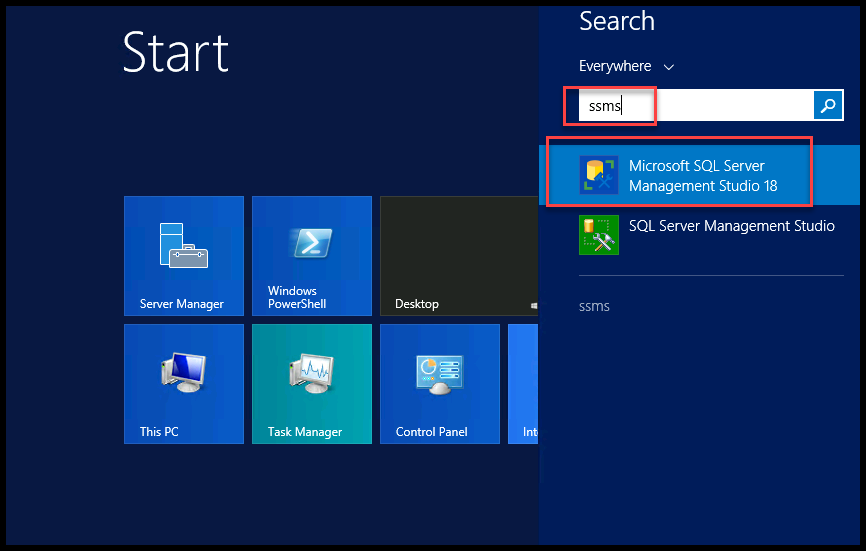
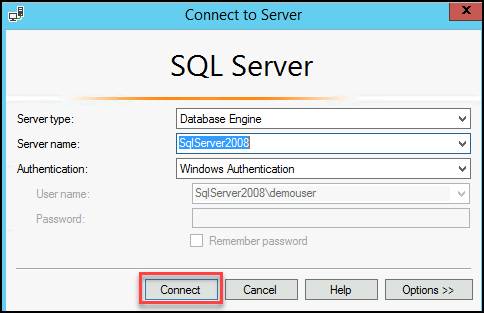

# Lab 1 - Exercise 1: Review the Legacy On-Prem Application and SQL Database

## Lab overview

In this lab, participants will delve into the evaluation and analysis of a legacy on-premises application hosted on the Internet Information Services (IIS) platform running on a Windows server.

## Lab scenario
In this lab, you will access the website of partsunlimited on localhost and also verify the database by logging into the database machine.

## Lab objectives (Duration: 10 minutes)

In this lab, you will complete the following tasks:
+ Task 1: Review the Legacy On-Prem Application and SQL Database.

In this lab, we have provisioned a web application called **Parts Unlimited**. It is an ASP.NET two-tier application that runs on a windows server with the SQL server back-end and web server front-end.

1. On the Microsoft Edge browser window, enter **localhost** and you will be redirected to the parts Unlimited web application hosted on 
   the web server IIS.

   
   
2. Go through the web application. We will be migrating this web application from on-prem to Azure App Services in further exercises.

3. From the provided VM, in the search bar, **Search** for **RDP** and **select** the **Remote Desktop Connection** app to verify the 
   database server which will be migrated to the Azure Sql Database.
   
   

4. Paste the **SQLVM DNS Name** in the **Computer** field and click on **Connect**.
   * **SQLVM DNS Name**: **<inject key="SQLVM DNS Name" style="color:blue" />**

     
 
5. Now, enter the SQLVM **username**, and **password** provided below and then click on the **Ok** button. Please add the **dot** and **back-slash** “.\” before the username.
   * **username**: **<inject key="SQLVM Username"/>** 
   * **password**: **<inject key="SQLVM Password"/>**
   
    

6. Next, click on the **Yes** button to accept the certificate and add in trusted certificates.

   
   
7. Launch SQL Server Management Studio (SSMS) from the Windows Start menu by typing **"SSMS" (1)** into the search bar, and then select **SQL Server Management Studio 18 (2)** from the search results.

    
   
8. Connect to your on-premises SQL Database by clicking **Connect** in the Object Explorer.
   
   
   
9. Once connected, expand the **Databases**, and observe that the database is present **Parts Unlimited** which helps in hoisting the web application.
   
   
   
10. Close all the windows and disconnect to the remote session of the SQL VM.
   
 Now, click on **Next** in the lab guide section in the bottom right corner to jump to the next exercise instructions.
   
## Summary
 
In this exercise, you have reviewed the legacy on-prem application and database. 

