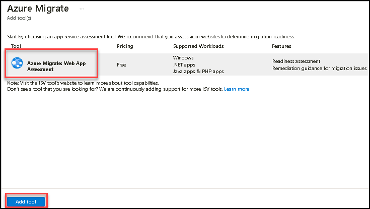
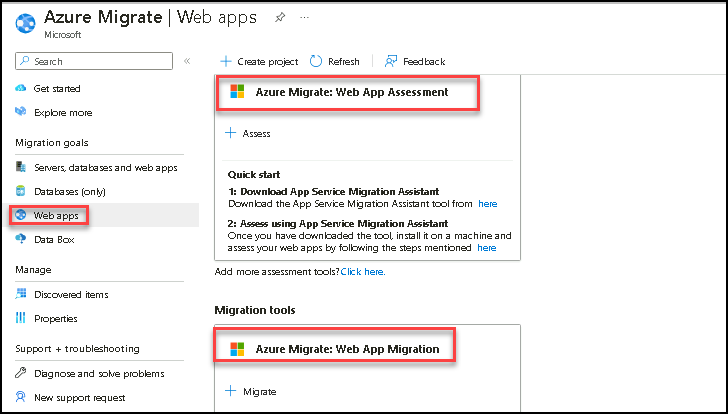

# Exercise 2: Assessment of Legacy Application using Azure Migrate App Migration Assistant

Duration: 10 minutes

Azure Migrate provides a centralized hub to assess and migrate on-premises servers, infrastructure, applications, and data to Azure. It provides a single portal to start, run, and track your migration to Azure. Azure Migrate comes with a range of tools for assessment and migration that we will use during our lab. We will use Azure Migrate as the central location for our assessment and migration efforts.

1. From the Windows search bar, search for **Default apps** and select it.

   
   
1. On the **Default apps** Blade, click on **Internet Explorer** and select **Microsoft Edge** for setting Microsoft Edge as the default browser.

   
   
1. Open the **Azure portal** from the shortcut and log in to Azure. When prompted, use the below credentials to complete the login process.

    * Email/Username: <inject key="AzureAdUserEmail"></inject>
    * Password: <inject key="AzureAdUserPassword"></inject>

    

1. Search for Azure Migrate, **Azure Migrate** will show you default **Assessment Tools (1)** and **Migration Tools (2)** hyperlinks (You might need to refresh your browser). For the Parts Unlimited website, **App Service Migration Assistant** is the one we need to use. Download links are present on Azure Migrate's Web Apps page. In our case, our lab environment comes with App Service Migration Assistant pre-installed on Parts Unlimited's web server which we will use.

   

1. Goto Azure Portal search for azure migrate, add the tools for assessment and migration via clicking on hyperlinks.
   
    

   

     

  

1. We will use **Azure Migrate: Database Assessment** to assess Parts Unlimited's database hosted on a SQL Server 2008 R2 server. Pick **Azure Migrate: Database Assessment (1)** and select **Add tool (2)**.

    

1. Under the Azure Migrate umbrella, we now have all of the necessary assessment and migration tools ready for Parts Unlimited.

    
    

## Summary
 
In this exercise, you have set up Azure Migrate to assess and migrate on-premises servers, infrastructure, applications, and data to Azure.

