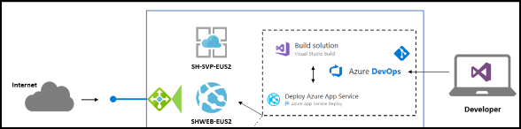

# Lab 3 - Exercise 2: Assessment of Legacy Application using Azure Migrate App Migration Assistant

## Lab overview

Azure Migrate is the Powerful tool which helps in assessing the machines readiness to migrate the Azure. this tool helps in migrate the machines, webapps and databases from on premise,hyper-v and different cloud providers.

## Lab scenario
Azure Migrate provides a centralized hub to assess and migrate on-premises servers, infrastructure, applications, and data to Azure. It provides a single portal to start, run, and track your migration to Azure. Azure Migrate comes with a range of tools for assessment and migration that we will use during our lab. We will use Azure Migrate as the central location for our assessment and migration efforts.

## Lab objectives (Duration: 10 minutes)

In this lab, you will complete the following tasks:
+ Task 1: Assessment of localhost website

## Architecture Diagram

  

## Task 1: Assessment of localhost website

1. From the Windows search bar, search for **Default apps** and select it.

   
   
1. On the **Default apps** Blade, click on **Internet Explorer** and select **Microsoft Edge** for setting Microsoft Edge as the default browser.

   
   
1. Open the **Azure portal** from the shortcut and log in to Azure. When prompted, use the below credentials to complete the login process.

    * Email/Username: <inject key="AzureAdUserEmail"></inject>
    * Password: <inject key="AzureAdUserPassword"></inject>

    

1. Search for Azure Migrate, **Azure Migrate** will show you default **Assessment Tools (1)** and **Migration Tools (2)** hyperlinks (You might need to refresh your browser). For the Parts Unlimited website, **App Service Migration Assistant** is the one we need to use. Download links are present on Azure Migrate's Web Apps page. In our case, our lab environment comes with App Service Migration Assistant pre-installed on Parts Unlimited's web server which we will use.

   

1. Go to Azure Portal search for azure migrate, add the tools for assessment and migration via clicking on hyperlinks.
   
    

   

     

  

1. We will use **Azure App Service Migration Assistant** installed on the **HostVM** to do an assessment of the website.

    

1. Please open the app service migration assistant and select the webiste named **Default Web site** to perform the assessment and click on **Next**.

    

1. We are done with the assessment of the website, the assessment reports will show the compatibility of as success, error and warning for the website to migrate to azure app service.

    

1. Under the Azure Migrate umbrella, we now have all of the necessary assessment and migration tools ready for **Parts Unlimited** website to migrate to azure app services and in the next excercise you will learn on how to migrate the **Parts Unlimited** to App Services. .

    
## Summary
 
In this exercise, you have completed assessment of Website based on IIS to migrate to azure app services.

