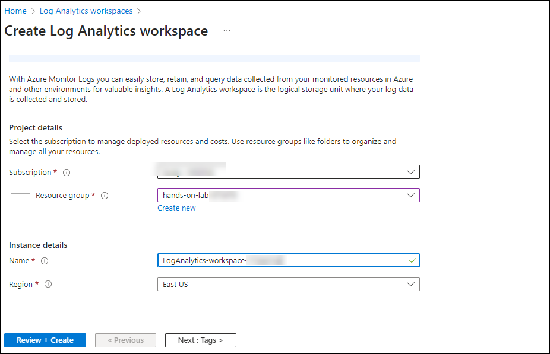
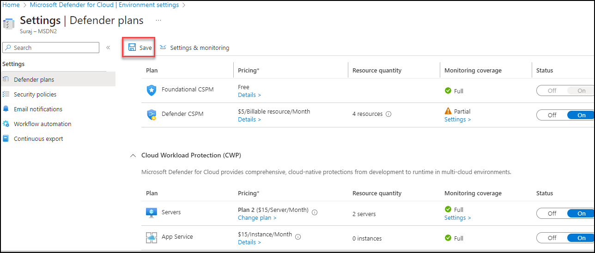
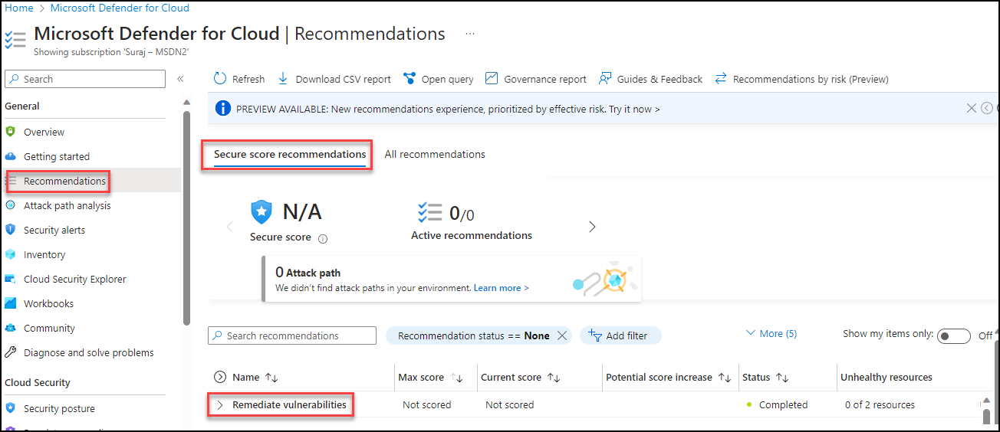

# Lab 4 - Exercise 1 : Secure Workloads with Defender for Cloud  

## Lab overview

Microsoft Defender for Cloud, a comprehensive cloud security solution designed to protect workloads, applications, and data in cloud environments. The focus of the lab is on understanding and implementing security measures using Defender for Cloud to safeguard cloud-based workloads effectively.

## Lab scenario
 You are a Security Operations Analyst working at a company that is implementing Miccrosft azure Defender for cloud. You start by assigning preset security policies in EOP and Microsoft azure Defender for cloud.

## Lab objectives ( Duration: 30 minutes)
In this lab, you will complete the following tasks:
- Task 1: Create a Log Analytics Workspace
- Task 2: Enable Microsoft Defender for Cloud for Servers and DBs
- Task 3: Enable Vulnerability Assessment and Review Recommendations

## Architecture Diagram

  

### Task 1: Create a Log Analytics Workspace

In this task, you will create a Log Analytics workspace for use with Microsoft Defender for Cloud.

1. In the Search bar of the Azure portal, type **Log Analytics**, then select **Log Analytics workspaces**.
   
   

1. Select **+ Create** from the command bar.
    
   

1. Select Resource Group from the drop down(Sentinel-rg).

1. For the Name, enter something unique like **uniquenameDefender**.

1. Select the default Region 

1. Select **Review + Create**.

   

1. Once the workspace validation has passed, select **Create**. Wait for the new workspace to be provisioned, this may take a few minutes.

   

### Task 2: Enable Microsoft Defender for Cloud

In this task, you will enable and configure Microsoft Defender for Cloud.

1. In the Search bar of the Azure portal, type *Defender*, then select **Microsoft Defender for Cloud**.

   

1. Click the left menu and click on **Getting started**. On the **Getting Started** page, under the **Upgrade** tab, make sure your subscription is selected and then select the **Upgrade** button at the bottom of the page. It takes about 2 minutes.

    

1. In the left menu for Microsoft Defender for Cloud, under Management, select **Environment settings**.

   
   
1. Select the subscription (or equivalent name in your Language). 

    .png)

1. Review the Azure resources that are now protected with the Defender for Cloud plans.

1. Select the **Settings & monitoring** tab from the Settings area (next to Save).

   

1. Review the monitoring extensions. Confirm that **Log Analytics agent/Azure Monitor agent** is **Off**. Close the Settings & monitoring page by selecting the 'X' on the upper right of the page.
   > **Note:** If **Log Analytics agent/Azure 
 Monitor agent** is **On** then change to **Off**. Press continoue on the top of right side.

   
    
1. To go back to the **Environment settings** and select the '>' to the left of your subscription.

1. Select the Log Analytics workspace you created earlier *uniquenameDefender* to review the available options and pricing.

1. Select **Enable all plans** for  services (**servers**) which you want to onboard (to the right of Select Defender plan) and then select **Save**. Wait for the *"Microsoft Defender plan for workspace uniquenameDefender was saved successfully!"* notification to appear.

   

   >**Note:** If the page is not being displayed, refresh your Edge browser and try again and if Plans are already enable no need to change anything.

### Task 3: Enable Vulnerability Assessment and Review Recommendations

In this task, you will enable the vulnerability assessment Microsoft Defender for Cloud and review the recommendation.

1. Enable the Vulnerability assessment settings for the machines. on **Environment settings** page. click on **Settings** under servers plan. and turn **ON** Vulnerability assessment 
   settings for machine

   

   

1. Select a vulnerability assessment solution, Click on **Apply** and **Continue**. make sure to **save** the settings on the  **Environment settings** page.

   

   

1. Now we will **Review** the vulnerability assessment recommendations. go to Microsoft Defender for Cloud and click on **Recommendations**.

    

1. Expand the Recommendations to view the actions to perform to make the machines Healthy from Vulnerable.

   

1. For this lab there are only few recommendations and we can also see the status whether recommendations completed or not to track the vulnerability assessment activity based on actions performed on the recommendations.

## Summary
In this exercise, you have created the log analytics workspace and enbaled the plans of Microsoft defender for cloud for your azure resources, also you have enabled the vulnerability assessment for the machines and recommendations reviewed.
