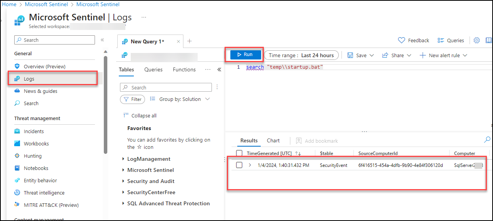
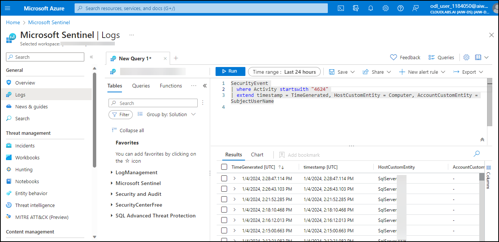

# Lab 5 - Exercise 1 : SIEM with Sentinel 

## Lab overview

Microsoft Azure Sentinel, a cloud-native Security Information and Event Management (SIEM) solution. The focus of the lab is to provide hands-on experience in setting up and using Sentinel for effective security monitoring, threat detection, and response within an organization's cloud and on-premises environments.

## Lab scenario
In this lab you will walk through the process of creating an  Microsoft Sentinel instance.  You will also set up the permissions to ensure access to the resources that will get deployed to support  Microsoft Sentinel.  Once this basic setup is done you will walk through the steps for connecting Microsoft Sentinel to your data sources, set up a workbook, and do a brief walk-through of some of key capabilities available in Microsoft Sentinel. 

## Lab objectives (Duration: 60 minutes)

In this lab, you will complete the following task:

+ Task 1: Create a Microsoft Sentinel instance
+ Task 2: Ingest Logs from Defender for Cloud and Azure Active Directory and Azure Activity.
+ Task 3: Simulate attack and investigate threats
+ Task 4: Query Logs with KQL

## Architecture diagram


## Task 1: Create a Microsoft Sentinel instance

1. In the Azure portal, in the **Search Bar** search for **Microsoft Sentinel** then select **Microsoft Sentinel** from the search results. 

   

1. From the Microsoft Sentinel page, select **+ Create**.

1. From Add Microsoft Sentinel to a workspace, then select newly created workspace **LogAnalytics-workspace-<inject key="DeploymentID" enableCopy="false"/> (1)** and click on **Add (2)**.

   

1. Once the new workspace is added, the Microsoft Sentinel | News & guides page will display., including that the Microsoft Sentinel free trial is activated. Select **OK**  Note the three steps listed on the Get started page.

   
   
   


## Task 2: Ingest Logs from Defender for Cloud, Azure Active Directory (Microsoft Entra ID) and Azure Activity

1. Enabling Defender to monitor events

1. In the Search bar of the Azure portal, type *Defender*, then select **Microsoft Defender for Cloud**.

1. From Defender for Cloud's menu, open **Environment settings**.

1. Select **Subscription** and click on *Defender Plans* on left blade. Then you need to click on *Settings&Monitoring* inbetween the page at top left.

   

1. Enable the **Log Analytics agent** which will Collects security-related configurations and event logs from the machine and stores the data in your Log Analytics workspace for analysis.

   

   

1. For Microsoft Defender data to ingest to Sentinel you need to use the connectors provided by the Sentinel.

   

1. Now you need to click on install the conenctor of Microsoft Defender for Cloud, Microsoft 365 Defender, Azure Active Directory (Microsoft Entra ID) and Azure Activity  to get the logs 
   into the Sentinel

   

   


## Task 3: Simulate attack and investigate threats

# Persistence Attack with Registry Key Add 

1. Log into WINDOWS Server again.

1. In the search of the task bar, enter *Command*. Command Prompt will be displayed in the search results. Right-click on the Command Prompt and select **Run as Administrator**. Select **Yes** in the User Account Control window that appears to allow the app to run.

1. In the Command Prompt, create a Temp folder in the root directory. Remember to press Enter after the last row:

    ```CommandPrompt
    cd \
    mkdir temp
    cd temp
    notepad startup.bat
    ```
1. Save the empty startup.bat file opened.

1. Copy and run this command to simulate program persistence:

    ```CommandPrompt
    REG ADD "HKCU\SOFTWARE\Microsoft\Windows\CurrentVersion\Run" /V "SOC Test" /t REG_SZ /F /D "C:\temp\startup.bat"
    ```

# Command and Control Attack with DNS

1. Copy and run this command to create a script that will simulate a DNS query to a C2 server:

    ```CommandPrompt
    notepad c2.ps1
    ```

1. Select **Yes** to create a new file and copy the following PowerShell script into *c2.ps1*.

    >**Note:** Pasting into the virtual machine file might not show the full script length. Make sure the script matches the instructions within the *c2.ps1* file.

    ```PowerShell
    param(
        [string]$Domain = "microsoft.com",
        [string]$Subdomain = "subdomain",
        [string]$Sub2domain = "sub2domain",
        [string]$Sub3domain = "sub3domain",
        [string]$QueryType = "TXT",
        [int]$C2Interval = 8,
        [int]$C2Jitter = 20,
        [int]$RunTime = 240
    )
    $RunStart = Get-Date
    $RunEnd = $RunStart.addminutes($RunTime)
    $x2 = 1
    $x3 = 1 
    Do {
        $TimeNow = Get-Date
        Resolve-DnsName -type $QueryType $Subdomain".$(Get-Random -Minimum 1 -Maximum 999999)."$Domain -QuickTimeout
        if ($x2 -eq 3 )
        {
            Resolve-DnsName -type $QueryType $Sub2domain".$(Get-Random -Minimum 1 -Maximum 999999)."$Domain -QuickTimeout
            $x2 = 1
        }
        else
        {
            $x2 = $x2 + 1
        }    
        if ($x3 -eq 7 )
        {
            Resolve-DnsName -type $QueryType $Sub3domain".$(Get-Random -Minimum 1 -Maximum 999999)."$Domain -QuickTimeout
            $x3 = 1
        }
        else
        {
            $x3 = $x3 + 1
        }
        $Jitter = ((Get-Random -Minimum -$C2Jitter -Maximum $C2Jitter) / 100 + 1) +$C2Interval
        Start-Sleep -Seconds $Jitter
    }
    Until ($TimeNow -ge $RunEnd)
    ```

1. In the Notepad menu, select **File** and then **Save**. 

1. Go back to the Command Prompt window, enter the following command and press Enter.

    ```CommandPrompt
    Start PowerShell.exe -file c2.ps1
    ```
    
      
   
    >**Note:** You will see DNS resolve errors. This is expected.

    >**Important**: Do not close these windows. Let this PowerShell script run in the background. The command needs to generate log entries for some hours. You can proceed to the next task and next exercises while this script runs. The data created by this task will be used in the Threat Hunting lab later. This process will not create substantial amounts of data or processing.

# Privilege Elevation Attack with User Add

1. Login again to WINDOES SERVER virtual machine as Admin with the password: ****<inject key="SQLVM Password"/>****. if you get disconnected from the virtual machine.

1. Open the command prompt, In the Command Prompt, create a Temp folder in the root directory. Remember to press Enter after the last row:

    ```CommandPrompt
    cd \
    ```
    ```CommandPrompt
    cd temp
    ```

1. Copy and run this command to simulate the creation of an Admin account. Remember to press Enter after the last row:

    ```CommandPrompt
    net user theusernametoadd /add
    ```
    ```CommandPrompt
    net user theusernametoadd ThePassword1!
    ```
    ```CommandPrompt
    net localgroup administrators theusernametoadd /add
    ```

# Playbook Creation

In this task, you will create a playbook for next task.

1. In the Search bar of the Azure portal, type *Sentinel*, then select **Microsoft Sentinel**.

1. Select the Microsoft Sentinel Workspace you created earlier.

1. Select the **Automation** form the *Configuration* section.

   

1. Click on create and select **Playbook with incident trigger**.

1. Select the resource group and give  playbook name **PostMessageTeams-OnIncident**

   

1. Select Enable diagnostics logs in Log Analytics and select your workspace.

1. Click on Next: Connections, Review + Create  and Click on Create and continue to designer.

## Task 4: Query Logs With KQL

>**Important:** The next steps are done on a different machine than the one you were previously working on. Look for the Virtual Machine name references.

In this task, you will create a detection for the first attack of the previous exercise.

1. In the Search bar of the Azure portal, type *Sentinel*, then select **Microsoft Sentinel**.

1. Select the Microsoft Sentinel Workspace you created earlier.

1. Select **Logs** from the *General* section.

1. **Run** the following KQL Statement again to recall the tables where we have this data:

    ```KQL
    search "temp\\startup.bat"
    ```
   
    
    >**Note:** A result with the event might take up to 5 minutes to appear. Wait until it does. If it does not appear, make sure you have rebooted WINServer as instructed in the previous exercise and that you have completed Task #3 of the Learning Path 6 Lab, Exercise 2.
     
1. The table *SecurityEvent* looks to have the data already normalized and is easy for us to query. Expand the row to see all the columns related to the record.

1. From the results, we now know that the Threat Actor is using startup.bat and the program is located in C:\temp. **Run** the following statement to replace the *search* operator with the *where* operator in our query:

    ```KQL
    SecurityEvent 
    | where Activity startswith "4624" 
    ```
   

1. It is important to help the Security Operations Center Analyst by providing as much context about the alert as you can. This includes projecting Entities for use in the investigation graph. **Run** the following query:

    ```KQL
    SecurityEvent 
    | where Activity startswith "4624" 
    | extend timestamp = TimeGenerated, HostCustomEntity = Computer, AccountCustomEntity = SubjectUserName
    ```

1. Now that you have a good detection rule, in the Logs window, select the **+ New alert rule** in the command bar and then select **Create Microsoft Sentinel alert**. This will create a new Scheduled rule. **Hint:** You might need to select the ellipsis (...) button in the command bar.

1. This starts the "Analytics rule wizard". For the *General* tab type:

    |Setting|Value|
    |---|---|
    |Name|Startup RegKey|
    |Description|Startup RegKey in c:\temp|
    |Tactics|Persistence|
    |Severity|High|

1. Select **Next: Set rule logic >** button.

1. On the *Set rule logic* tab, the *Rule query* should be populated already with you KQL query, as well as the entities under *Alert enrichment - Entity mapping*.

    |Entity|Identifier|Data Field|
    |:----|:----|:----|
    |Account|FullName|AccountCustomEntity|
    |Host|Hostname|HostCustomEntity|

1. If **Hostname** isn't selected for *Host* Entity, select it from the drop-down list.

1. For *Query scheduling* set the following:

    |Setting|Value|
    |---|---|
    |Run Query every|5 minutes|
    |Lookup data from the last|1 Days|

    >**Note:** We are purposely generating many incidents for the same data. This enables the Lab to use these alerts.

1. Leave the rest of the options with the defaults. Select **Next: Incident settings>** button.

1. For the *Incident settings* tab, leave the default values and select **Next: Automated response >** button.

1. On the *Automated response* tab under *Automation rules*, select **Add new**.

1. Use the settings in the table to configure the automation rule.

    |Setting|Value|
    |:----|:----|
    |Automation rule name|Startup RegKey|
    |Trigger|When incident is created|
    |Actions |Run playbook|
    |playbook |PostMessageTeams-OnIncident|

    >**Note:** You have already assigned permissions to the playbook, so it will be available.

1. Select **Apply**

1. Select the **Next: Review >** button.
  
1. On the *Review and create* tab, select the **Create** button to create the new Scheduled Analytics rule.

# Privilege Elevation Attack Detection

In this task, you will create a detection for the second attack of the previous exercise.

1. In the Microsoft Sentinel portal, select **Logs** from the General section in case you navigated away from this page.

1. **Run** the following KQL Statement to identify any entry that refers to administrators:

    ```KQL
    search "administrators" 
    | summarize count() by $table
    ```

1. The result might show events from different tables, but in our case, we want to investigate the SecurityEvent table. The EventID and Event that we are looking is "4732 - A member was added to a security-enabled local group". With this, we will identify adding a member to a privileged group. **Run** the following KQL query to confirm:

    ```KQL
    SecurityEvent 
    | where EventID == 4732
    | where TargetAccount == "Builtin\\Administrators"
    ```

1. Expand the row to see all the columns related to the record. The username of the account added as Administrator does not show. The issue is that instead of storing the username, we have the Security IDentifier (SID). **Run** the following KQL to match the SID to the username that was added to the Administrators group:

    ```KQL
    SecurityEvent 
    | where EventID == 4732
    | where TargetAccount == "Builtin\\Administrators"
    | extend Acct = MemberSid, MachId = SourceComputerId  
    | join kind=leftouter (
        SecurityEvent 
        | summarize count() by TargetSid, SourceComputerId, TargetUserName 
        | project Acct1 = TargetSid, MachId1 = SourceComputerId, UserName1 = TargetUserName) on $left.MachId == $right.MachId1, $left.Acct == $right.Acct1
    ```

   

1. Extend the row to show the resulting columns, in the last one, we see the name of the added user under the *UserName1* column we *project* within the KQL query. It is important to help the Security Operations Analyst by providing as much context about the alert as you can. This includes projecting Entities for use in the investigation graph. **Run** the following query:

    ```KQL
    SecurityEvent 
    | where EventID == 4732
    | where TargetAccount == "Builtin\\Administrators"
    | extend Acct = MemberSid, MachId = SourceComputerId  
    | join kind=leftouter (
        SecurityEvent 
        | summarize count() by TargetSid, SourceComputerId, TargetUserName 
        | project Acct1 = TargetSid, MachId1 = SourceComputerId, UserName1 = TargetUserName) on $left.MachId == $right.MachId1, $left.Acct == $right.Acct1
    | extend timestamp = TimeGenerated, HostCustomEntity = Computer, AccountCustomEntity = UserName1
    ```

1. Now that you have a good detection rule, in the Logs window, select **+ New alert rule** in the command bar and then select **Create Microsoft Sentinel alert**. **Hint:** You might need to select the ellipsis (...) button in the command bar.

1. This starts the "Analytics rule wizard". For the *General* tab type:

    |Setting|Value|
    |---|---|
    |Name|**SecurityEvent Local Administrators User Add**|
    |Description|**User added to Local Administrators group**|
    |Tactics|**Privilege Escalation**|
    |Severity|**High**|

1. Select **Next: Set rule logic >** button. 

1. On the *Set rule logic* tab, the *Rule query* should be populated already with you KQL query, as well the entities under *Alert enrichment - Entity mapping*.

1. For *Query scheduling* set the following:

    |Setting|Value|
    |---|---|
    |Run Query every|5 minutes|
    |Lookup data from the last|1 Days|

    >**Note:** We are purposely generating many incidents for the same data. This enables the Lab to use these alerts.

1. Leave the rest of the options with the defaults. Select **Next: Incident settings>** button.

1. For the *Incident settings* tab, leave the default values and select **Next: Automated response >** button.

1. On the *Automated response* tab under *Automation rules*, select **Add new**.

1. Use the settings in the table to configure the automation rule.

   |Setting|Value|
   |:----|:----|
   |Automation rule name|SecurityEvent Local Administrators User Add|
   |Trigger|When incident is created|
   |Actions |Run playbook|
   |playbook |PostMessageTeams-OnAlert|

   >**Note:** You have already assigned permissions to the playbook, so it will be available.

1. Select **Apply**

1. Select the **Next: Review and create >** button.
  
1. On the *Review and create* tab, select the **Create** button to create the new Scheduled Analytics rule.


# Investigate an incident

In this task, you will investigate an incident.

1. Select your Microsoft Sentinel Workspace you created earlier.

1. Select the **Incidents** page under Threat management from left side blade.

1. Review the list of incidents.

    >**Note:** The Analytics rules are generating alerts and incidents on the same specific log entry. Remember that this was done in the *Query scheduling* configuration to generate more alerts and incidents to be utilized in the lab.
  
1. Select one of the **Startup RegKey** incidents.
   >**Note:** If its not show the page click on the << icon appear on the right side.

   

1. Review the incident details on the right blade that opened. Scroll down and select the **View full details** button.

1. If the "New incident experience" pop-up appears, follow the prompts by reading the information by selecting the **Next** button.

1. On the left blade of the incident, change the Status to **Active** and then select **Apply**.

   

1. Scroll down to the *Tags* area, select **+ (1)** and type **RegKey (2)** and select **OK (3)**.

    

1. Scroll down and in the *Write a comment...* box type: *I will research this* and select the **>** icon to submit the new comment.

    

1. Hide the left blade by selecting the **<<** icon next to the owner.

1. Review the **Incident timeline** window. For the *Startup RegKey* alert, select the ellipsis **(...) (1)** icon and then **Run playbook (2)**. You will see the *Alert playbooks*. This option helps you to run playbooks manually.

    

1. Close the *Alert playbooks* blade by selecting the **x** icon in the top right.

1. Review the **Entities** window. At least the *Host* entity that we mapped within the KQL query from the previous exercise should appear. **Hint:** If no entities are shown, refresh the page.

1. Select the **Tasks (Preview)** button from the command bar.

1. Select **+ Add task**, type **Review who owns the machine** in the Title box and select **Save**.

1. Close the *Incident tasks (Preview)* blade by selecting the **x** icon in the top right.

1. Select the new **Activity Log** button from the command bar.

1. Review the actions you have taken during this exercise.

1. Close the *Incident activity log* blade by selecting the **x** icon in the top right.

1. From the almost hidden left blade, select the user icon named **Unassigned (1)**. The new incident experience allows quick changes from here.

1. Select **Assign to me (2)** and then scroll down to select **Apply (3)** to save the changes.

   

1. Expand the left blade by selecting the **>>** icon. and then select the **Investigate** button.

      

1. **Hover** the WINServer entity icon and wait for new *exploration queries* to be shown. It looks like *Related Alerts* has more data on it. Select the name of the exploration query **Related Alerts** to bring them to the investigation graph or select **Events >** to investigate them with a KQL query.

    

   >**Hint:** If the icons are too small for your screen, select **(+)** to magnify them.   

1. Close the query window by selecting the **X** icon at the top right to go back to the *Investigation* page.

1. Now select the **WINServer** entity, a window on the right opens for more detailed information. Review the **Info** page.

1. Select **Timeline** button. Hover the incidents and see which things on the graph occurred at what point in time.

1. Select **Entities** button and review the *Entities* and *Alerts* related to *WINServer*.

1. Close the investigation graph by selecting the **X** icon at the top right of the page.

1. Back in the incident page, in the left pane select **Active Status** and select **Closed**. 

1. In the *Select classification* drop-down review the different options. After that, select **True positive - suspicious activity** and then select **Apply**.


## Summary
 
In this exercise, you have completed the creation of Sentinel and performing basic KQL queries. we also performed teh simulated attack and investigated the same using Sentinel .
