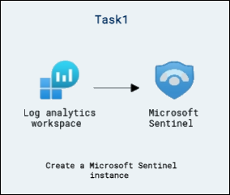
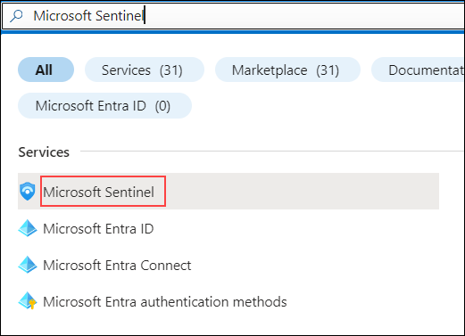
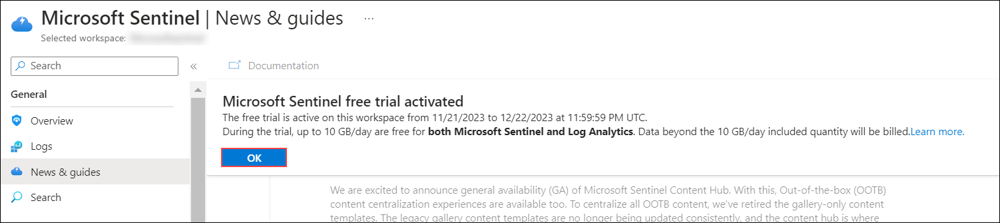
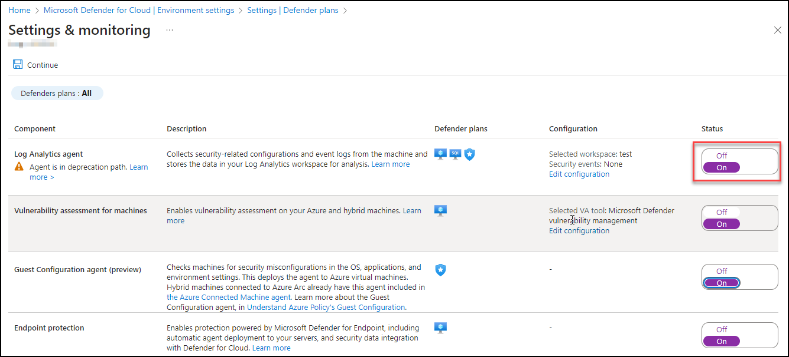
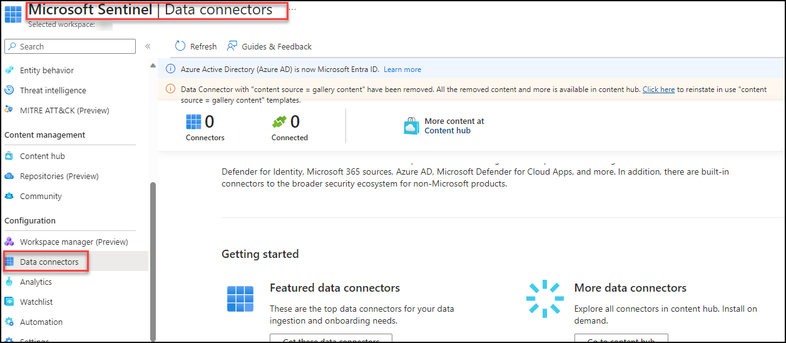
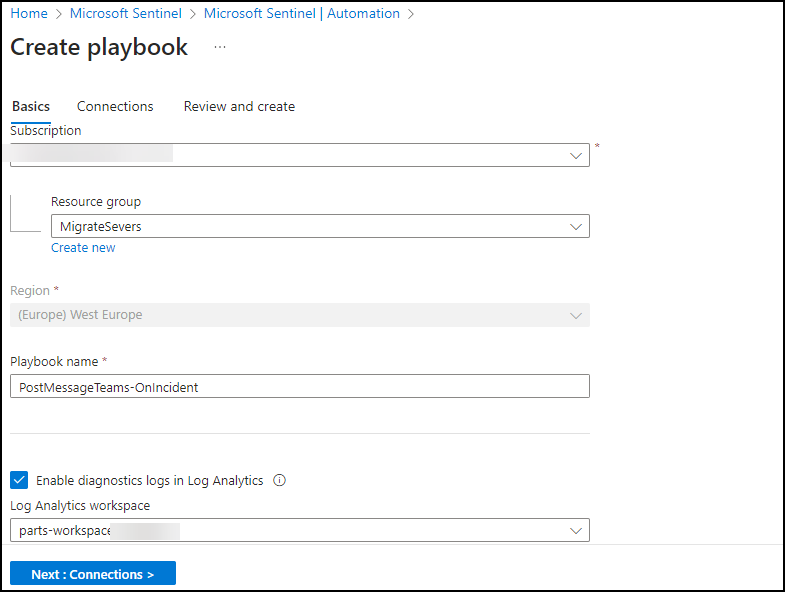
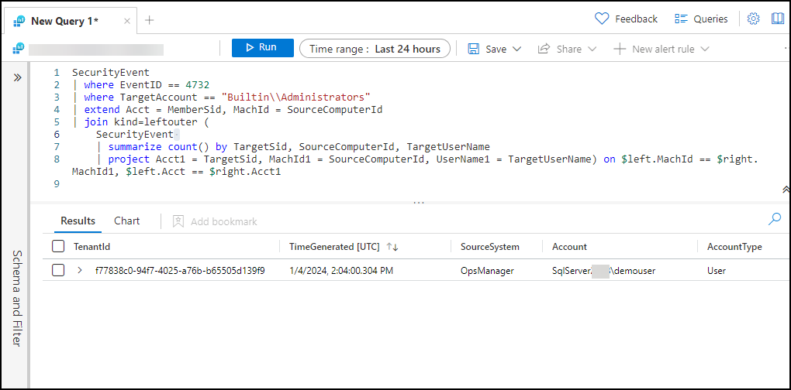

# Exercise : SIEM with Sentinel 

## Lab scenario
In this lab you will walk through the process of creating an  Microsoft Sentinel instance.  You will also set up the permissions to ensure access to the resources that will get deployed to support  Microsoft Sentinel.  Once this basic setup is done you will walk through the steps for connecting Microsoft Sentinel to your data sources, set up a workbook, and do a brief walk-through of some of key capabilities available in Microsoft Sentinel. 

## Lab objectives (Duration: 60 minutes)

In this lab, you will complete the following task:

+ Task 1: Create a Microsoft Sentinel instance
+ Task 2: Ingest Logs from Defender for Cloud and Azure Active Directory and Azure Activity.
+ Task 3: Query Logs with KQL
+ Task 4: Simulate attack and investigate threats

## Architecture diagram



## Task 1: Create a Microsoft Sentinel instance

1. In the Azure portal, in the **Search Bar** search for **Microsoft Sentinel** then select **Microsoft Sentinel** from the search results. 

   

1. From the Microsoft Sentinel page, select **+ Create**.

1. From Add Microsoft Sentinel to a workspace, then select newly created workspace **LogAnalytics-workspace-<inject key="DeploymentID" enableCopy="false"/> (1)** and click on **Add (2)**.

   

1. Once the new workspace is added, the Microsoft Sentinel | News & guides page will display., including that the Microsoft Sentinel free trial is activated. Select **OK**  Note the three steps listed on the Get started page.

   
   
   


## Task 2: Ingest Logs from Defender for Cloud and Azure Active Directory (Microsoft Entra ID) and Azure Activity

1. Enabling Defender to monitor events

1. In the Search bar of the Azure portal, type *Defender*, then select **Microsoft Defender for Cloud**.

1. From Defender for Cloud's menu, open **Environment settings**.

1. Select **Subscription** and click on *Defender Plans* on left blade. Then you need to click on *Settings&Monitoring* inbetween the page at top left.

   

1. Enable the **Log Analytics agent** which will Collects security-related configurations and event logs from the machine and stores the data in your Log Analytics workspace for analysis.

   

   

1. For Microsoft Defender data to ingest to Sentinel you need to use the connectors provided by the Sentinel.

   

1. Now you need to click on install the conenctor of Microsoft Defender for Cloud, Microsoft 365 Defender, Azure Active Directory (Microsoft Entra ID) and Azure Activity  to get the logs 
   into the Sentinel

   

   


## Task 3: Query Logs with KQL

In this task, you will access a Log Analytics environment where you can practice writing KQL statements.

1. Go-to Microsoft Sentinel and select your log analytics workspace.

1. On the left menu click on **logs** close if any tutorial window pops up click on 'X'.

1. Explore the available tables listed in the tab on the left side of the screen.

1. In the query editor, enter the following query and select the **Run** button. You should see the query results in the bottom window.

    ```KQL
    SecurityEvent
    ```

1. Next to the first record, select the **>** to expand the information for the row.

    

# Run Basic KQL Statements

In this task, you will build basic KQL statements.

>**Important:**  For each query, clear the previous statement from the Query Window or open a new Query Windows by selecting **+** after the last opened tab (up to 25).

1. Change the **Time range** to **Last hour** in the Query Window.

    

1. The following statement demonstrates the **search** operator, which searches all columns in the table for the value. In the Query Window enter the following statement and select **Run**: 

    ```KQL
    search "err"
    ```

    >**Note**: It will taskes some time to reflect, you can move to other command check this later. *Hint*: If the above command is not getting output replace **"err"** to **"new"**.

    

    >**Note**: It will taskes some time to reflect, you can move to other command check this later. *Hint*: If the above command is not getting output replace **"err"** to **"new"**.

1. The following statement demonstrates **search** across tables listed within the **in** clause. In the Query Window enter the following statement and select **Run**: 

    ```KQL
    search in (SecurityEvent,SecurityAlert,A*) "err"
    ```
    >**Note**: It will taskes some time to reflect, you can move to other command check this later. *Hint*: If the above command is not getting output replace **"err"** to **"new"**

    >**Note**: It will taskes some time to reflect, you can move to other command check this later. *Hint*: If the above command is not getting output replace **"err"** to **"new"**

1. Change back the **Time range** to **Last 24 hours** in the Query Window.

1. The following statements demonstrate the **where** operator, which filters on a specific predicate. In the Query Window enter the following statements and run each query separately: 
    >**Note:** You should select **Run** after entering each query from the code blocks below.

    ```KQL
    SecurityEvent  
    | where TimeGenerated > ago(1h)
    ```

    ```KQL
    SecurityEvent  
    | where TimeGenerated > ago(1h) and EventID == "4624"
    ```

    ```KQL
    SecurityEvent  
    | where TimeGenerated > ago(1h)
    | where EventID == 8002
    | where AccountType =~ "user"
    ```

    ```KQL
    SecurityEvent  
    | where TimeGenerated > ago(1h) and EventID in (8002, 4688)
 
    ```

1. The following statement demonstrates the use of the **let** statement to declare *variables*. In the Query Window enter the following statement and select **Run**: 

    ```KQL
    let timeOffset = 1h;
    let discardEventId = 4688;
    SecurityEvent
    | where TimeGenerated > ago(timeOffset*2) and TimeGenerated < ago(timeOffset)
    | where EventID != discardEventId
    ```

1. The following statement demonstrates the use of the **let** statement to declare a *dynamic list*. In the Query Window enter the following statement and select **Run**: 

    ```KQL
    let suspiciousAccounts = datatable(account: string) [
      @"\administrator", 
      @"NT AUTHORITY\SYSTEM"
    ];
    SecurityEvent  
    | where TimeGenerated > ago(1h)
    | where Account in (suspiciousAccounts)
    ```

    >**Tip:** You can re-format the query easily by selecting the ellipsis (...) in the Query window and selecting **Format query**.

1. The following statement demonstrates the use of the **let** statement to declare a *dynamic table*. In the Query Window enter the following statement and select **Run**: 

    ```KQL
    let LowActivityAccounts =
        SecurityEvent 
        | summarize cnt = count() by Account 
        | where cnt < 1000;
    LowActivityAccounts
    ```

1. Change the **Time range** to **Last hour** in the Query Window. This will limit our results for the following statements.

1. The following statement demonstrates the **extend** operator, which creates a calculated column and adds it to the result set. In the Query Window enter the following statement and select **Run**: 

    ```KQL
    SecurityEvent  
    | where TimeGenerated > ago(1h)
    | where ProcessName != "" and Process != ""
    | extend StartDir =  substring(ProcessName,0, string_size(ProcessName)-string_size(Process))
    ```

1. The following statement demonstrates the **order by** operator, which sorts the rows of the input table by one or more columns in ascending or descending order. The **order by** operator is an alias to the **sort by** operator. In the Query Window enter the following statement and select **Run**: 

    ```KQL
    SecurityEvent  
    | where TimeGenerated > ago(1h)
    | where ProcessName != "" and Process != ""
    | extend StartDir =  substring(ProcessName,0, string_size(ProcessName)-string_size(Process))
    | order by StartDir desc, Process asc
    ```

1. The following statements demonstrate the **project** operator, which selects the columns to include in the order specified. In the Query Window enter the following statement and select **Run**: 

    ```KQL
    SecurityEvent  
    | where TimeGenerated > ago(1h)
    | where ProcessName != "" and Process != ""
    | extend StartDir =  substring(ProcessName,0, string_size(ProcessName)-string_size(Process))
    | order by StartDir desc, Process asc
    | project Process, StartDir
    ```

1. The following statements demonstrate the **project-away** operator, which selects the columns to exclude from the output. In the Query Window enter the following statement and select **Run**: 

    ```KQL
    SecurityEvent  
    | where TimeGenerated > ago(1h)
    | where ProcessName != "" and Process != ""
    | extend StartDir =  substring(ProcessName,0, string_size(ProcessName)-string_size(Process))
    | order by StartDir desc, Process asc
    | project-away ProcessName
    ```

# Analyze Results in KQL with the Summarize Operator

In this task, you will build KQL statements to aggregate data. **Summarize** groups the rows according to the **by** group columns, and calculates aggregations over each group.

1. The following statement demonstrates the **count()** function, which returns a count of the group. In the Query Window enter the following statement and select **Run**: 

    ```KQL
    SecurityEvent  
    | where TimeGenerated > ago(1h) and EventID == '4688'  
    | summarize count() by Process, Computer
    ```

1. The following statement demonstrates the **count()** function, but in this example, we name the column as *cnt*. In the Query Window enter the following statement and select **Run**: 

    ```KQL
    SecurityEvent  
    | where TimeGenerated > ago(1h) and EventID == '4624'  
    | summarize cnt=count() by AccountType, Computer
    ```

1. The following statement demonstrates the **dcount()** function, which returns an approximate distinct count of the group elements. In the Query Window enter the following statement and select **Run**: 

    ```KQL
    SecurityEvent  
    | where TimeGenerated > ago(1h)
    | summarize dcount(IpAddress)
    ```

1. The following statements demonstrate the importance of understanding results based on the order of the *pipe*. In the Query Window enter the following queries and run each query separately: 

    1. **Query 1** will have Accounts for which the last activity was a login. The SecurityEvent table will first be summarized and return the most current row for each Account. Then only rows with EventID equals 4624 (login) will be returned.

        ```KQL
        SecurityEvent  
        | summarize arg_max(TimeGenerated, *) by Account
        | where EventID == '4624'  
        ```

    1. **Query 2** will have the most recent login for Accounts that have logged in. The SecurityEvent table will be filtered to only include EventID = 4624. Then these results will be summarized for the most current login row by Account.

        ```KQL
        SecurityEvent  
        | where EventID == '4624'  
        | summarize arg_max(TimeGenerated, *) by Account
        ```

    >**Note:**  You can also review the "Total CPU" and "Data used for processed query" by selecting the "Query details" link on the lower right and compare the data between both statements.

1. The following statement demonstrates the **make_list()** function, which returns a *list* of all the values within the group. This KQL query will first filter the EventID with the where operator. Next, for each Computer, the results are a JSON array of Accounts. The resulting JSON array will include duplicate accounts. In the Query Window enter the following statement and select **Run**: 

    ```KQL
    SecurityEvent  
    | where TimeGenerated > ago(1h)
    | where EventID == '4624'  
    | summarize make_list(Account) by Computer
    ```

1. The following statement demonstrates the **make_set()** function, which returns a set of *distinct* values within the group. This KQL query will first filter the EventID with the where operator. Next, for each Computer, the results are a JSON array of unique Accounts. In the Query Window enter the following statement and select **Run**: 

    ```KQL
    SecurityEvent  
    | where TimeGenerated > ago(1h)
    | where EventID == '4624'  
    | summarize make_set(Account) by Computer
    ```

# Create visualizations in KQL with the Render Operator

In this task, you will use generate visualizations with KQL statements.

1. The following statement demonstrates the **render** operator (which renders results as a graphical output), using a **barchart** visualization. In the Query Window enter the following statement and select **Run**: 

    ```KQL
    SecurityEvent  
    | where TimeGenerated > ago(1h)
    | summarize count() by Account
    | render barchart
    ```

1. The following statement demonstrates the **render** operator visualizing results with a time series. The **bin()** function rounds all values in a timeframe and groups them, used frequently in combination with **summarize**. If you have a scattered set of values, the values are grouped into a smaller set of specific values. Combining the generated results and pipe them to a **render** operator with a **timechart** provides a time series visualization. In the Query Window enter the following statement and select **Run**: 

    ```KQL
    SecurityEvent  
    | where TimeGenerated > ago(1h)
    | summarize count() by bin(TimeGenerated, 1m)
    | render timechart
    ```


## Task 4: Simulate attack and investigate threats

# Persistence Attack with Registry Key Add 

1. Follow the instructions to log into WINServer again.

1. In the search of the task bar, enter *Command*. Command Prompt will be displayed in the search results. Right-click on the Command Prompt and select **Run as Administrator**. Select **Yes** in the User Account Control window that appears to allow the app to run.

1. In the Command Prompt, create a Temp folder in the root directory. Remember to press Enter after the last row:

    ```CommandPrompt
    cd \
    mkdir temp
    cd temp
    ```

1. Copy and run this command to simulate program persistence:

    ```CommandPrompt
    REG ADD "HKCU\SOFTWARE\Microsoft\Windows\CurrentVersion\Run" /V "SOC Test" /t REG_SZ /F /D "C:\temp\startup.bat"
    ```

# Command and Control Attack with DNS

1. Copy and run this command to create a script that will simulate a DNS query to a C2 server:

    ```CommandPrompt
    notepad c2.ps1
    ```

1. Select **Yes** to create a new file and copy the following PowerShell script into *c2.ps1*.

    >**Note:** Pasting into the virtual machine file might not show the full script length. Make sure the script matches the instructions within the *c2.ps1* file.

    ```PowerShell
    param(
        [string]$Domain = "microsoft.com",
        [string]$Subdomain = "subdomain",
        [string]$Sub2domain = "sub2domain",
        [string]$Sub3domain = "sub3domain",
        [string]$QueryType = "TXT",
        [int]$C2Interval = 8,
        [int]$C2Jitter = 20,
        [int]$RunTime = 240
    )
    $RunStart = Get-Date
    $RunEnd = $RunStart.addminutes($RunTime)
    $x2 = 1
    $x3 = 1 
    Do {
        $TimeNow = Get-Date
        Resolve-DnsName -type $QueryType $Subdomain".$(Get-Random -Minimum 1 -Maximum 999999)."$Domain -QuickTimeout
        if ($x2 -eq 3 )
        {
            Resolve-DnsName -type $QueryType $Sub2domain".$(Get-Random -Minimum 1 -Maximum 999999)."$Domain -QuickTimeout
            $x2 = 1
        }
        else
        {
            $x2 = $x2 + 1
        }    
        if ($x3 -eq 7 )
        {
            Resolve-DnsName -type $QueryType $Sub3domain".$(Get-Random -Minimum 1 -Maximum 999999)."$Domain -QuickTimeout
            $x3 = 1
        }
        else
        {
            $x3 = $x3 + 1
        }
        $Jitter = ((Get-Random -Minimum -$C2Jitter -Maximum $C2Jitter) / 100 + 1) +$C2Interval
        Start-Sleep -Seconds $Jitter
    }
    Until ($TimeNow -ge $RunEnd)
    ```

1. In the Notepad menu, select **File** and then **Save**. 

1. Go back to the Command Prompt window, enter the following command and press Enter.

    ```CommandPrompt
    Start PowerShell.exe -file c2.ps1
    ```
    
      
   
    >**Note:** You will see DNS resolve errors. This is expected.

    >**Important**: Do not close these windows. Let this PowerShell script run in the background. The command needs to generate log entries for some hours. You can proceed to the next task and next exercises while this script runs. The data created by this task will be used in the Threat Hunting lab later. This process will not create substantial amounts of data or processing.

# Privilege Elevation Attack with User Add

In this task, you will perform attacks on the host connected with Azure Arc that has the Azure Monitor Agent configured.

>**Important:** The next steps are done on a different machine than the one you were previously working on. Look for the Virtual Machine name references.

1. Go to Hyper-V manager. Connect to WINSERVER virtual machine.

1. Login to WINSERVER virtual machine as Admin with the password: **Password.1!!**.  

    >**Important:** The lab *SAVE* functionality can cause WINServer to become disconnected from Azure Arc. A reboot will solve the issue. 

1. Select **Start** in Windows. Then **Power**, next **Restart**.

1. Follow the instructions to log into WINServer again.

1. In the search of the taskbar, enter *Command*. A Command Prompt will be displayed in the search results. Right-click on the Command Prompt and select **Run as Administrator**. Select **Yes** in the User Account Control window that appears to allow the app to run.

1. In the Command Prompt, create a Temp folder in the root directory. Remember to press Enter after the last row:

    ```CommandPrompt
    cd \
    ```
    ```CommandPrompt
    mkdir temp
    ```
    ```CommandPrompt
    cd temp
    ```

1. Copy and run this command to simulate the creation of an Admin account. Remember to press Enter after the last row:

    ```CommandPrompt
    net user theusernametoadd /add
    ```
    ```CommandPrompt
    net user theusernametoadd ThePassword1!
    ```
    ```CommandPrompt
    net localgroup administrators theusernametoadd /add
    ```

# Playbook Creation

In this task, you will create a playbook for next task.

1. In the Search bar of the Azure portal, type *Sentinel*, then select **Microsoft Sentinel**.

1. Select the Microsoft Sentinel Workspace you created earlier.

1. Select the **Automation** form the *Configuration* section.

   

1. Click on create and select **Playbook with incident trigger**.

1. Select the resource group and give  playbook name **PostMessageTeams-OnIncident**

   

1. Select Enable diagnostics logs in Log Analytics and select your workspace.

1. Click on Next:Connections, Review + Create  and Click on Create and continue to designer.

# Persistence Attack Detection

>**Important:** The next steps are done on a different machine than the one you were previously working on. Look for the Virtual Machine name references.

In this task, you will create a detection for the first attack of the previous exercise.

1. In the Search bar of the Azure portal, type *Sentinel*, then select **Microsoft Sentinel**.

1. Select the Microsoft Sentinel Workspace you created earlier.

1. Select **Logs** from the *General* section.

1. **Run** the following KQL Statement again to recall the tables where we have this data:

    ```KQL
    search "temp\\startup.bat"
    ```
   
    
    >**Note:** A result with the event might take up to 5 minutes to appear. Wait until it does. If it does not appear, make sure you have rebooted WINServer as instructed in the previous exercise and that you have completed Task #3 of the Learning Path 6 Lab, Exercise 2.
     
1. The table *SecurityEvent* looks to have the data already normalized and is easy for us to query. Expand the row to see all the columns related to the record.

1. From the results, we now know that the Threat Actor is using reg.exe to add keys to the Registry key and the program is located in C:\temp. **Run** the following statement to replace the *search* operator with the *where* operator in our query:

    ```KQL
    SecurityEvent 
    | where Activity startswith "4624" 
    ```
   

1. It is important to help the Security Operations Center Analyst by providing as much context about the alert as you can. This includes projecting Entities for use in the investigation graph. **Run** the following query:

    ```KQL
    SecurityEvent 
    | where Activity startswith "4624" 
    | extend timestamp = TimeGenerated, HostCustomEntity = Computer, AccountCustomEntity = SubjectUserName
    ```

1. Now that you have a good detection rule, in the Logs window, select the **+ New alert rule** in the command bar and then select **Create Microsoft Sentinel alert**. This will create a new Scheduled rule. **Hint:** You might need to select the ellipsis (...) button in the command bar.

1. This starts the "Analytics rule wizard". For the *General* tab type:

    |Setting|Value|
    |---|---|
    |Name|Startup RegKey|
    |Description|Startup RegKey in c:\temp|
    |Tactics|Persistence|
    |Severity|High|

1. Select **Next: Set rule logic >** button.

1. On the *Set rule logic* tab, the *Rule query* should be populated already with you KQL query, as well as the entities under *Alert enrichment - Entity mapping*.

    |Entity|Identifier|Data Field|
    |:----|:----|:----|
    |Account|FullName|AccountCustomEntity|
    |Host|Hostname|HostCustomEntity|

1. If **Hostname** isn't selected for *Host* Entity, select it from the drop-down list.

1. For *Query scheduling* set the following:

    |Setting|Value|
    |---|---|
    |Run Query every|5 minutes|
    |Lookup data from the last|1 Days|

    >**Note:** We are purposely generating many incidents for the same data. This enables the Lab to use these alerts.

1. Leave the rest of the options with the defaults. Select **Next: Incident settings>** button.

1. For the *Incident settings* tab, leave the default values and select **Next: Automated response >** button.

1. On the *Automated response* tab under *Automation rules*, select **Add new**.

1. Use the settings in the table to configure the automation rule.

    |Setting|Value|
    |:----|:----|
    |Automation rule name|Startup RegKey|
    |Trigger|When incident is created|
    |Actions |Run playbook|
    |playbook |PostMessageTeams-OnIncident|

    >**Note:** You have already assigned permissions to the playbook, so it will be available.

1. Select **Apply**

1. Select the **Next: Review >** button.
  
1. On the *Review and create* tab, select the **Create** button to create the new Scheduled Analytics rule.

# Privilege Elevation Attack Detection

In this task, you will create a detection for the second attack of the previous exercise.

1. In the Microsoft Sentinel portal, select **Logs** from the General section in case you navigated away from this page.

1. **Run** the following KQL Statement to identify any entry that refers to administrators:

    ```KQL
    search "administrators" 
    | summarize count() by $table
    ```

1. The result might show events from different tables, but in our case, we want to investigate the SecurityEvent table. The EventID and Event that we are looking is "4732 - A member was added to a security-enabled local group". With this, we will identify adding a member to a privileged group. **Run** the following KQL query to confirm:

    ```KQL
    SecurityEvent 
    | where EventID == 4732
    | where TargetAccount == "Builtin\\Administrators"
    ```

1. Expand the row to see all the columns related to the record. The username of the account added as Administrator does not show. The issue is that instead of storing the username, we have the Security IDentifier (SID). **Run** the following KQL to match the SID to the username that was added to the Administrators group:

    ```KQL
    SecurityEvent 
    | where EventID == 4732
    | where TargetAccount == "Builtin\\Administrators"
    | extend Acct = MemberSid, MachId = SourceComputerId  
    | join kind=leftouter (
        SecurityEvent 
        | summarize count() by TargetSid, SourceComputerId, TargetUserName 
        | project Acct1 = TargetSid, MachId1 = SourceComputerId, UserName1 = TargetUserName) on $left.MachId == $right.MachId1, $left.Acct == $right.Acct1
    ```

   

1. Extend the row to show the resulting columns, in the last one, we see the name of the added user under the *UserName1* column we *project* within the KQL query. It is important to help the Security Operations Analyst by providing as much context about the alert as you can. This includes projecting Entities for use in the investigation graph. **Run** the following query:

    ```KQL
    SecurityEvent 
    | where EventID == 4732
    | where TargetAccount == "Builtin\\Administrators"
    | extend Acct = MemberSid, MachId = SourceComputerId  
    | join kind=leftouter (
        SecurityEvent 
        | summarize count() by TargetSid, SourceComputerId, TargetUserName 
        | project Acct1 = TargetSid, MachId1 = SourceComputerId, UserName1 = TargetUserName) on $left.MachId == $right.MachId1, $left.Acct == $right.Acct1
    | extend timestamp = TimeGenerated, HostCustomEntity = Computer, AccountCustomEntity = UserName1
    ```

1. Now that you have a good detection rule, in the Logs window, select **+ New alert rule** in the command bar and then select **Create Microsoft Sentinel alert**. **Hint:** You might need to select the ellipsis (...) button in the command bar.

1. This starts the "Analytics rule wizard". For the *General* tab type:

    |Setting|Value|
    |---|---|
    |Name|**SecurityEvent Local Administrators User Add**|
    |Description|**User added to Local Administrators group**|
    |Tactics|**Privilege Escalation**|
    |Severity|**High**|

1. Select **Next: Set rule logic >** button. 

1. On the *Set rule logic* tab, the *Rule query* should be populated already with you KQL query, as well the entities under *Alert enrichment - Entity mapping*.

1. For *Query scheduling* set the following:

    |Setting|Value|
    |---|---|
    |Run Query every|5 minutes|
    |Lookup data from the last|1 Days|

    >**Note:** We are purposely generating many incidents for the same data. This enables the Lab to use these alerts.

1. Leave the rest of the options with the defaults. Select **Next: Incident settings>** button.

1. For the *Incident settings* tab, leave the default values and select **Next: Automated response >** button.

1. On the *Automated response* tab under *Automation rules*, select **Add new**.

1. Use the settings in the table to configure the automation rule.

   |Setting|Value|
   |:----|:----|
   |Automation rule name|SecurityEvent Local Administrators User Add|
   |Trigger|When incident is created|
   |Actions |Run playbook|
   |playbook |PostMessageTeams-OnAlert|

   >**Note:** You have already assigned permissions to the playbook, so it will be available.

1. Select **Apply**

1. Select the **Next: Review and create >** button.
  
1. On the *Review and create* tab, select the **Create** button to create the new Scheduled Analytics rule.

