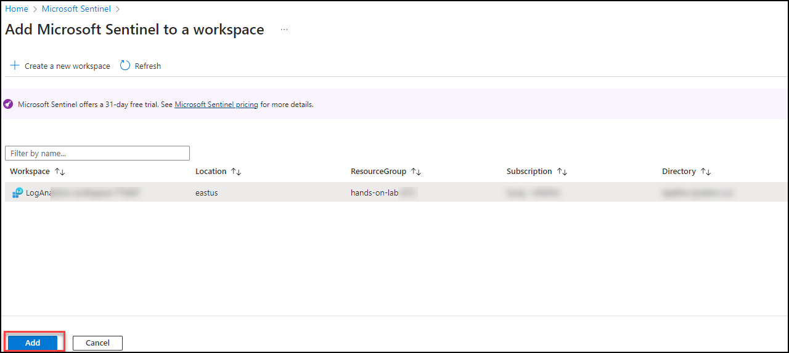
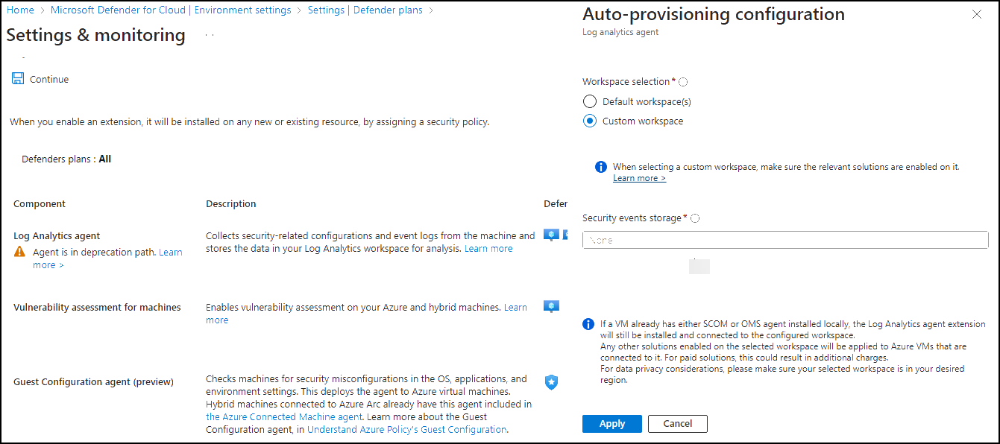
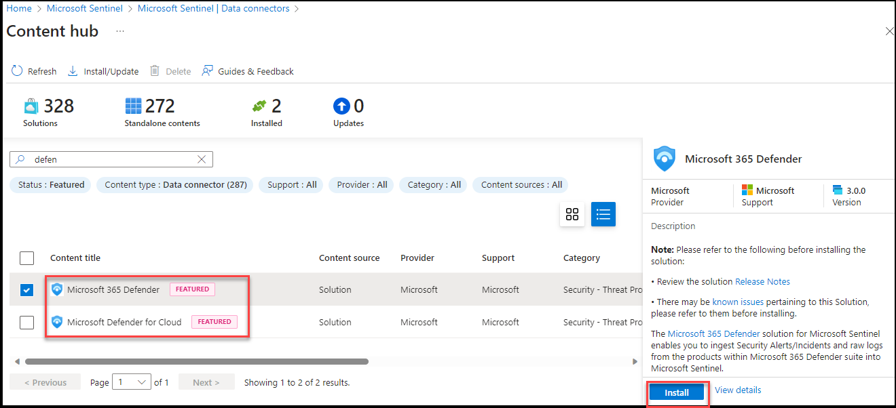
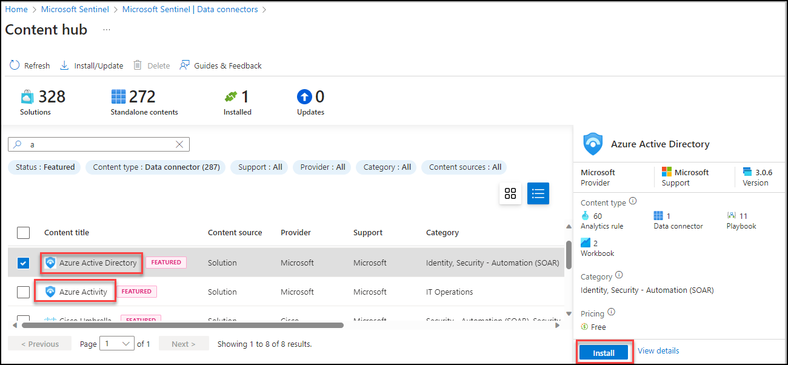

# Exercise : SIEM with Sentinel 

## Lab scenario
In this lab you will walk through the process of creating an  Microsoft Sentinel instance.  You will also set up the permissions to ensure access to the resources that will get deployed to support  Microsoft Sentinel.  Once this basic setup is done you will walk through the steps for connecting Microsoft Sentinel to your data sources, set up a workbook, and do a brief walk-through of some of key capabilities available in Microsoft Sentinel. 

## Lab objectives (Duration: 60 minutes)

In this lab, you will complete the following task:

+ Task 1: Create a Microsoft Sentinel instance
+ Task 2: Ingest Logs from Defender for Cloud and Azure Active Directory and Azure Activity.
+ Task 3: Query Logs with KQL
+ Task 4: Simulate attack and investigate threats

## Architecture diagram


## Task 1: Create a Microsoft Sentinel instance

1. In the Azure portal, in the **Search Bar** search for **Microsoft Sentinel** then select **Microsoft Sentinel** from the search results. 

   

1. From the Microsoft Sentinel page, select **+ Create**.

1. From Add Microsoft Sentinel to a workspace, then select newly created workspace **LogAnalytics-workspace-<inject key="DeploymentID" enableCopy="false"/> (1)** and click on **Add (2)**.

   

1. Once the new workspace is added, the Microsoft Sentinel | News & guides page will display., including that the Microsoft Sentinel free trial is activated. Select **OK**  Note the three steps listed on the Get started page.

   
   
   


## Task 2: Ingest Logs from Defender for Cloud and Azure Active Directory (Microsoft Entra ID) and Azure Activity

1. Enabling Defender to monitor events

1. In the Search bar of the Azure portal, type *Defender*, then select **Microsoft Defender for Cloud**.

1. From Defender for Cloud's menu, open **Environment settings**.

1. Select **Subscription** and click on *Defender Plans* on left blade. Then you need to click on *Settings&Monitoring* inbetween the page at top left.

   

1. Enable the **Log Analytics agent** which will Collects security-related configurations and event logs from the machine and stores the data in your Log Analytics workspace for analysis.

   

   

1. For Microsoft Defender data to ingest to Sentinel you need to use the connectors provided by the Sentinel.

   

1. Now you need to click on install the conenctor of Microsoft Defender for Cloud, Microsoft 365 Defender, Azure Active Directory (Microsoft Entra ID) and Azure Activity  to get the logs 
   into the Sentinel

   

   


## Task 3: Query Logs with KQL

In this task, you will access a Log Analytics environment where you can practice writing KQL statements.

1. Go-to Microsoft Sentinel and select your log analytics workspace.

1. On the left menu click on **logs** close if any tutorial window pops up click on 'X'.

1. Explore the available tables listed in the tab on the left side of the screen.

1. In the query editor, enter the following query and select the **Run** button. You should see the query results in the bottom window.

    ```KQL
    SecurityEvent
    ```

1. Next to the first record, select the **>** to expand the information for the row.

    

# Run Basic KQL Statements

In this task, you will build basic KQL statements.

>**Important:**  For each query, clear the previous statement from the Query Window or open a new Query Windows by selecting **+** after the last opened tab (up to 25).

1. Change the **Time range** to **Last hour** in the Query Window.

    

1. The following statement demonstrates the **search** operator, which searches all columns in the table for the value. In the Query Window enter the following statement and select **Run**: 

    ```KQL
    search "err"
    ```

    >**Note**: It will taskes some time to reflect, you can move to other command check this later. *Hint*: If the above command is not getting output replace **"err"** to **"new"**.

    

    >**Note**: It will taskes some time to reflect, you can move to other command check this later. *Hint*: If the above command is not getting output replace **"err"** to **"new"**.

1. The following statement demonstrates **search** across tables listed within the **in** clause. In the Query Window enter the following statement and select **Run**: 

    ```KQL
    search in (SecurityEvent,SecurityAlert,A*) "err"
    ```
    >**Note**: It will taskes some time to reflect, you can move to other command check this later. *Hint*: If the above command is not getting output replace **"err"** to **"new"**

    >**Note**: It will taskes some time to reflect, you can move to other command check this later. *Hint*: If the above command is not getting output replace **"err"** to **"new"**

1. Change back the **Time range** to **Last 24 hours** in the Query Window.

1. The following statements demonstrate the **where** operator, which filters on a specific predicate. In the Query Window enter the following statements and run each query separately: 
    >**Note:** You should select **Run** after entering each query from the code blocks below.

    ```KQL
    SecurityEvent  
    | where TimeGenerated > ago(1h)
    ```

    ```KQL
    SecurityEvent  
    | where TimeGenerated > ago(1h) and EventID == "4624"
    ```

    ```KQL
    SecurityEvent  
    | where TimeGenerated > ago(1h)
    | where EventID == 8002
    | where AccountType =~ "user"
    ```

    ```KQL
    SecurityEvent  
    | where TimeGenerated > ago(1h) and EventID in (8002, 4688)
 
    ```

1. The following statement demonstrates the use of the **let** statement to declare *variables*. In the Query Window enter the following statement and select **Run**: 

    ```KQL
    let timeOffset = 1h;
    let discardEventId = 4688;
    SecurityEvent
    | where TimeGenerated > ago(timeOffset*2) and TimeGenerated < ago(timeOffset)
    | where EventID != discardEventId
    ```

1. The following statement demonstrates the use of the **let** statement to declare a *dynamic list*. In the Query Window enter the following statement and select **Run**: 

    ```KQL
    let suspiciousAccounts = datatable(account: string) [
      @"\administrator", 
      @"NT AUTHORITY\SYSTEM"
    ];
    SecurityEvent  
    | where TimeGenerated > ago(1h)
    | where Account in (suspiciousAccounts)
    ```

    >**Tip:** You can re-format the query easily by selecting the ellipsis (...) in the Query window and selecting **Format query**.

1. The following statement demonstrates the use of the **let** statement to declare a *dynamic table*. In the Query Window enter the following statement and select **Run**: 

    ```KQL
    let LowActivityAccounts =
        SecurityEvent 
        | summarize cnt = count() by Account 
        | where cnt < 1000;
    LowActivityAccounts
    ```

1. Change the **Time range** to **Last hour** in the Query Window. This will limit our results for the following statements.

1. The following statement demonstrates the **extend** operator, which creates a calculated column and adds it to the result set. In the Query Window enter the following statement and select **Run**: 

    ```KQL
    SecurityEvent  
    | where TimeGenerated > ago(1h)
    | where ProcessName != "" and Process != ""
    | extend StartDir =  substring(ProcessName,0, string_size(ProcessName)-string_size(Process))
    ```

1. The following statement demonstrates the **order by** operator, which sorts the rows of the input table by one or more columns in ascending or descending order. The **order by** operator is an alias to the **sort by** operator. In the Query Window enter the following statement and select **Run**: 

    ```KQL
    SecurityEvent  
    | where TimeGenerated > ago(1h)
    | where ProcessName != "" and Process != ""
    | extend StartDir =  substring(ProcessName,0, string_size(ProcessName)-string_size(Process))
    | order by StartDir desc, Process asc
    ```

1. The following statements demonstrate the **project** operator, which selects the columns to include in the order specified. In the Query Window enter the following statement and select **Run**: 

    ```KQL
    SecurityEvent  
    | where TimeGenerated > ago(1h)
    | where ProcessName != "" and Process != ""
    | extend StartDir =  substring(ProcessName,0, string_size(ProcessName)-string_size(Process))
    | order by StartDir desc, Process asc
    | project Process, StartDir
    ```

1. The following statements demonstrate the **project-away** operator, which selects the columns to exclude from the output. In the Query Window enter the following statement and select **Run**: 

    ```KQL
    SecurityEvent  
    | where TimeGenerated > ago(1h)
    | where ProcessName != "" and Process != ""
    | extend StartDir =  substring(ProcessName,0, string_size(ProcessName)-string_size(Process))
    | order by StartDir desc, Process asc
    | project-away ProcessName
    ```

# Analyze Results in KQL with the Summarize Operator

In this task, you will build KQL statements to aggregate data. **Summarize** groups the rows according to the **by** group columns, and calculates aggregations over each group.

1. The following statement demonstrates the **count()** function, which returns a count of the group. In the Query Window enter the following statement and select **Run**: 

    ```KQL
    SecurityEvent  
    | where TimeGenerated > ago(1h) and EventID == '4688'  
    | summarize count() by Process, Computer
    ```

1. The following statement demonstrates the **count()** function, but in this example, we name the column as *cnt*. In the Query Window enter the following statement and select **Run**: 

    ```KQL
    SecurityEvent  
    | where TimeGenerated > ago(1h) and EventID == '4624'  
    | summarize cnt=count() by AccountType, Computer
    ```

1. The following statement demonstrates the **dcount()** function, which returns an approximate distinct count of the group elements. In the Query Window enter the following statement and select **Run**: 

    ```KQL
    SecurityEvent  
    | where TimeGenerated > ago(1h)
    | summarize dcount(IpAddress)
    ```

1. The following statements demonstrate the importance of understanding results based on the order of the *pipe*. In the Query Window enter the following queries and run each query separately: 

    1. **Query 1** will have Accounts for which the last activity was a login. The SecurityEvent table will first be summarized and return the most current row for each Account. Then only rows with EventID equals 4624 (login) will be returned.

        ```KQL
        SecurityEvent  
        | summarize arg_max(TimeGenerated, *) by Account
        | where EventID == '4624'  
        ```

    1. **Query 2** will have the most recent login for Accounts that have logged in. The SecurityEvent table will be filtered to only include EventID = 4624. Then these results will be summarized for the most current login row by Account.

        ```KQL
        SecurityEvent  
        | where EventID == '4624'  
        | summarize arg_max(TimeGenerated, *) by Account
        ```

    >**Note:**  You can also review the "Total CPU" and "Data used for processed query" by selecting the "Query details" link on the lower right and compare the data between both statements.

1. The following statement demonstrates the **make_list()** function, which returns a *list* of all the values within the group. This KQL query will first filter the EventID with the where operator. Next, for each Computer, the results are a JSON array of Accounts. The resulting JSON array will include duplicate accounts. In the Query Window enter the following statement and select **Run**: 

    ```KQL
    SecurityEvent  
    | where TimeGenerated > ago(1h)
    | where EventID == '4624'  
    | summarize make_list(Account) by Computer
    ```

1. The following statement demonstrates the **make_set()** function, which returns a set of *distinct* values within the group. This KQL query will first filter the EventID with the where operator. Next, for each Computer, the results are a JSON array of unique Accounts. In the Query Window enter the following statement and select **Run**: 

    ```KQL
    SecurityEvent  
    | where TimeGenerated > ago(1h)
    | where EventID == '4624'  
    | summarize make_set(Account) by Computer
    ```

# Create visualizations in KQL with the Render Operator

In this task, you will use generate visualizations with KQL statements.

1. The following statement demonstrates the **render** operator (which renders results as a graphical output), using a **barchart** visualization. In the Query Window enter the following statement and select **Run**: 

    ```KQL
    SecurityEvent  
    | where TimeGenerated > ago(1h)
    | summarize count() by Account
    | render barchart
    ```

1. The following statement demonstrates the **render** operator visualizing results with a time series. The **bin()** function rounds all values in a timeframe and groups them, used frequently in combination with **summarize**. If you have a scattered set of values, the values are grouped into a smaller set of specific values. Combining the generated results and pipe them to a **render** operator with a **timechart** provides a time series visualization. In the Query Window enter the following statement and select **Run**: 

    ```KQL
    SecurityEvent  
    | where TimeGenerated > ago(1h)
    | summarize count() by bin(TimeGenerated, 1m)
    | render timechart
    ```


## Task 4: Simulate attack and investigate threats
