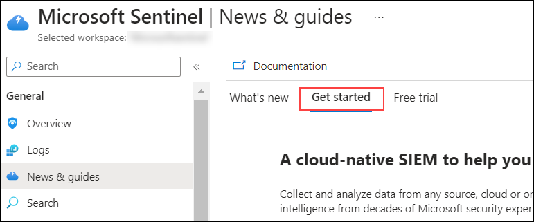

# Exercise : SIEM with Sentinel 

## Lab scenario
In this lab you will walk through the process of creating an  Microsoft Sentinel instance.  You will also set up the permissions to ensure access to the resources that will get deployed to support  Microsoft Sentinel.  Once this basic setup is done you will walk through the steps for connecting Microsoft Sentinel to your data sources, set up a workbook, and do a brief walk-through of some of key capabilities available in Microsoft Sentinel. 

## Lab objectives (Duration: 60 minutes)

In this lab, you will complete the following task:

+ Task 1: Create a Microsoft Sentinel instance
+ Task 2: Ingest Logs from Defender for Cloud and Azure Activity.
+ Task 3: Query Logs with KQL
+ Task 4: Simulate attack and investigate threats

## Architecture diagram

## Task 1:  Create a Microsoft Sentinel instance

1. In the Azure portal, in the **Search Bar** search for **Microsoft Sentinel** then select **Microsoft Sentinel** from the search results. 

   

1. From the Microsoft Sentinel page, select **+ Create**.

1. From Add Microsoft Sentinel to a workspace, then select newly created workspace **LogAnalytics-workspace-<inject key="DeploymentID" enableCopy="false"/> (1)** and click on **Add (2)**.

   

1. Once the new workspace is added, the Microsoft Sentinel | News & guides page will display., including that the Microsoft Sentinel free trial is activated. Select **OK**  Note the three steps listed on the Get started page.

   
   
   

1. Keep this page open, as you will use it in the next task.

## Task 1:  Ingest Logs from Defender for Cloud and Azure Activity

1. 
