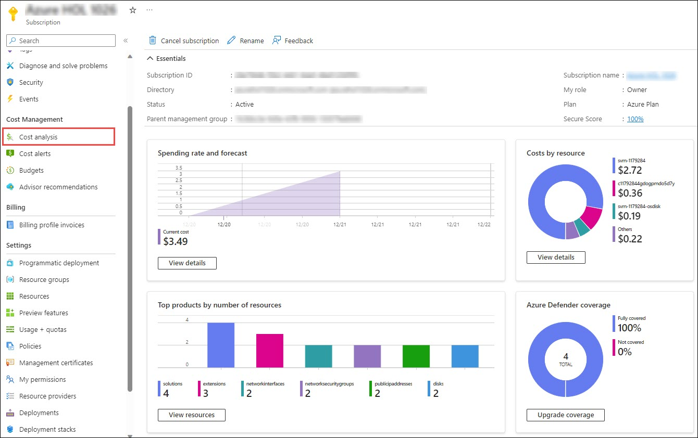

# Migrate & Secure Workloads  

## Overview

In this comprehensive lab, participants will embark on a dual-focused journey of migrating on-premises infrastructure to Azure and fortifying the newly migrated workloads with robust security measures. The lab revolves around the migration of a multi-tier application named 'SmartHotel' from Hyper-V VMs to Azure services, coupled with the implementation of Azure Defender for Cloud and Azure Sentinel for enhanced security and incident management.

Utilizing Azure Migrate, participants will assess the existing on-premises infrastructure hosted in Hyper-V, specifically the 'SmartHotel' multi-tier application. This includes evaluating the readiness of VMs for migration, Microsoft Data Migration Assistant (DMA) will be employed to assess the database migration feasibility. Subsequently, Azure Database Migration Service (DMS) will facilitate the smooth migration of databases to Azure database services and Azure App Service Migration Assistant for Migration of IIS hosted Partsunlimited WebApp. Azure Defender for Cloud will be deployed to secure the migrated servers and applications. Participants will onboard machines and configure security policies to fortify the entire infrastructure against potential threats. Azure Sentinel will be configured to serve as the central hub for incident and event management. Participants will utilize Sentinel to track and respond to security incidents, leveraging its robust capabilities for threat detection and response.

## Key features of Azure Migrate, Azure Defender for Cloud and Azure Sentinel

- **Azure Migrate**
  - Assessment and Discovery: Azure Migrate facilitates the assessment and discovery of on-premises infrastructure, providing insights into the Hyper-V environment hosting the database, 
   application, web, and web proxy tiers.
  - Dependency Visualization: Utilizing the Microsoft Monitoring Agent and Dependency Agent, Azure Migrate offers dependency visualization, allowing users to understand interdependencies 
   between different VMs for comprehensive migration planning.
  - Server Migration: Server Migration enables the migration of the application, web, and web proxy tiers to Azure VMs through a 'lift and shift' approach, simplifying the migration 
   process and reducing downtime.  

- **Azure Defender for Cloud**
  - Advanced Threat Protection: Azure Defender for Cloud provides advanced threat protection, leveraging machine learning and behavioral analytics to identify and mitigate security 
   threats across the database, application, web, and web proxy tiers
  - Threat Intelligence Integration: Integrates with threat intelligence feeds to enhance threat detection capabilities, ensuring that the security platform is continuously updated with 
   the latest information on potential risks and vulnerabilities.
  - Incident Reports: Generates detailed incident reports, offering insights into security events, alerts, and potential breaches across the entire infrastructure, including the SQL 
   Server database, application, web, and web proxy tiers.

- **Azure Sentinel**
  - Security Information and Event Management (SIEM): Azure Sentinel serves as a SIEM solution, offering a centralized view for security operations and incident response. It consolidates 
   security event logs and data from the SQL Server database, application, web, and web proxy tiers.
  - Threat Intelligence Integration: Integrates threat intelligence feeds to enrich security data, enhancing the platform's ability to identify and respond to potential threats across 
   the entire infrastructure.
  - Incident Detection and Investigation: Provides robust capabilities for incident detection and investigation, allowing security teams to analyze security events, track incidents, and 
   conduct thorough investigations into potential security breaches.
  - Playbooks and Automation: Enables the creation and execution of playbooks for automated response actions. This feature streamlines incident response, improving the efficiency of 
   security operations.

## Sandbox Scenario

The SmartHotel application is currently hosted on an on-premises Hyper-V infrastructure. Participants will use Azure Migrate to assess the infrastructure, discover dependencies, and plan for migration. setup the appliance on the Azure Migrate appliance on the Hyper-V host. Conduct an infrastructure assessment using Azure Migrate, gathering information about VMs and dependencies. Utilize the Microsoft Monitoring Agent and Dependency Agent to visualize dependencies between different VMs. Plan the migration of the database, application, web, and web proxy tiers to Azure VMs using Azure Migrate: Server Migration. 

The SQL Server database tier of the SmartHotel application needs to be migrated to Azure. Participants will use Microsoft Data Migration Assistant (DMA) for assessment and Azure Database Migration Service (DMS) for schema and data migration. Install DMA on the Hyper-V host to assess the SQL Server database. Use DMA to gather information about the database and identify migration considerations. Set up Azure Database Migration Service (DMS) to migrate the schema and data of the SQL Server database to Azure.

The migrated infrastructure, including the database, application, web, and web proxy tiers, needs to be secured against advanced threats. Participants will onboard machines to Azure Defender for Cloud and configure security policies. Onboard the Machines to Azure Defender for Cloud. Configure security policies to protect against advanced threats and vulnerabilities.

To enhance incident detection and response, participants will use Azure Sentinel as a SIEM solution. Azure Sentinel will be configured to centralize security event logs from the entire infrastructure. Configure Azure Sentinel to collect security event logs from Azure Defender For Cloud, Azure Activity and Microsoft Entra ID. Set up threat intelligence integration to enhance the platform's ability to detect potential threats. Create custom queries to detect security incidents and analyze security events.

To streamline incident response, participants will leverage Azure Sentinel's playbook automation features. Playbooks will be created and executed for automated response actions. Develop playbooks for common incident response actions, tailored to the SmartHotel application's security requirements. Execute playbooks to automate response actions and enhance the efficiency of incident management.

By implementing a robust Log analytics and threat detection program, Contoso aims to proactively identify and mitigate threats, reduce the risk of security breaches, and maintain a strong security posture in an ever-evolving threat landscape. This approach will enable Contoso to stay ahead of potential threats and protect its digital assets effectively.

## About the Sandbox

Using this environment, You'll be able to explore complete features and offerings listed. Please find the detailed overview of the sandbox environment below.

### Pre-provisioned resources

#### **Virtual Machines**: 

- 2 *Windows Server Datacenter* Virtual machines, virtual machine-related resources like Virtual networks, Network security groups, managed disks, Network interface cards, and IP addresses are deployed as part of the automation.

  These virtual machines are tailored and configured to the sandbox's specifications. Files, applications, packages, and OS configurations are all pre-configured. It is recommended that 
  you use the same virtual machine throughout the lab for the best experience.

#### **License and subscription**: 

- You'll have access to a pre-configured Microsoft user account with an active Azure subscription, a tenant. 
   
  User account has assigned as Owner at subscription. You need to use the same user account throughout the lab to get the most out of the lab. 

#### **Azure Credits**: 

- You have been given a quota of **$150 USD** which includes the running cost of Pre-deployed resources, license cost, and other resources deployed while running through the lab.

  You will receive **cost alerts** to your registered email address at **50%/75%/90%/95%/100%** of the allotted Azure Credit is spent.

  You can visit the Azure Subscription page to check the current Azure credit spend and Analysis on **Cost analysis** tab under the Cost Management option.

  

#### **Duration and Deletion of sandbox**:  

- The sandbox environment will be active for **30 days/730** hours from the time of registration. 
- The maximum allowed virtual machine uptime is only **40 hours**. It is recommended to deallocate the virtual machine when not in use.
- The virtual machine is set up with a custom feature called Idle start/stop. This custom package will check the virtual machine's idleness every **2 hours/120 minutes**. If the virtual 
  machine is left idle for over 2 hours, a pop-up window will appear, prompting you to respond. If you do not take action within 10 minutes, the virtual machine will shut down 
  automatically.  This feature is enabled in virtual machines to optimize Azure costs.
- when 100% of Azure credits are spent, the sandbox environment will get automatically deleted without any prior notification. To retain the environment for a longer period and to get 
  the most out of the environment, please follow the best practices mentioned below.

#### **Best practices**: 

- **Resources usage**: Please stop the virtual machines and other resources when not in use to minimize the Azure spend.

- **Azure Cost Analysis**: Maintain a practice of checking the Cost Analysis report of the assigned Azure subscription often in check the Azure spending so that the environment can be 
    retained for a longer duration of time.

- **Alert notifications**: Make sure to check your registered email's inbox for any alert-related mails. Alerts give you can head start to keep your Azure spending in control and to plan 
    out the remaining credits in the best way possible.

## Lab guide Content:

You will have access to a lab guide which is a reference material to assist you in getting started with the exploration. 

Based on your interests, you can use this lab guide as a reference to learn and test any Azure Migrate, Sentinel, Defender for Cloud feature.  You are also encouraged to explore additional features of Azure Migrate based on your interests and preferences.

- Lab 1 - Migrate Windows & Linux Servers to Azure
  - Exercise 1 - Create setup azure migrate
  - Exercise 2 - Discover assess workloads with appliance
  - Exercise 3 - Migrate servers to azure
    
- Lab 2 - Migrate SQL Databases to Azure SQL
  - Exercise 1 - Migrate SQLDatabase to AzureSQLDatabaseServices
    
- Lab3 - Migrate .Net Apps to Azure App Service
  - Exercise 1 - Migrate WebApps to AzureAppServices Review Legacy App Database
  - Exercise 2 - Migrate WebApps to AzureAppServices Assessment Legacy Application
  - Exercise 3 - Migrate WebApps to AzureAppServices Migrate Legacy Application
    
- Lab 4 - Secure Workloads with Defender for Cloud
  - Exercise 1 - Secure Workloads with Defender for Cloud
    
- Lab 5 - SIEM with Sentinel  
  - Exercise 1 - SIEM with Sentinel

### Azure services and related products

- Log Analytics Workspace
- Microsoft Defender for Cloud
- Azure Migrate
- Azure SQL Database
- Azure App Services
- Azure Database Migration Services
- Microsoft Sentinel
